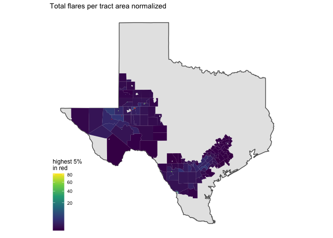

# flares

<!-- ```{python} -->
<!-- import wget -->
<!-- from zipfile import ZipFile -->
<!-- import os -->
<!-- url = 'https://www2.census.gov/geo/tiger/TIGER2016/TRACT/tl_2016_48_tract.zip' -->
<!-- wget.download(url, os.path.expanduser('~/tmp')) -->
<!-- file_name = os.path.expanduser('~/tmp/tl_2016_48_tract.zip') -->
<!-- ZipFile(file_name, 'r').extractall(os.path.expanduser('~/tmp/tl_2016_48_tract/')) -->
<!-- os.system("ls ~/tmp/tl_2016_48_tract/") -->
<!-- ``` -->

A total of 17,865 flares were reported in 2017.

Flares ocurred in a total of 61/ Exposure is defined as tracts within a
buffer of 5km from origin tract.

    ## GDAL version >= 3.1.0 | setting mapviewOptions(fgb = TRUE)

    ## PhantomJS not found. You can install it with webshot::install_phantomjs(). If it is installed, please make sure the phantomjs executable can be found via the PATH variable.

<div id="htmlwidget-e7913da7406e9b77e9c3" style="width:672px;height:480px;" class="leaflet html-widget"></div>
<script type="application/json" data-for="htmlwidget-e7913da7406e9b77e9c3">{"x":{"options":{"minZoom":1,"maxZoom":52,"crs":{"crsClass":"L.CRS.EPSG3857","code":null,"proj4def":null,"projectedBounds":null,"options":{}},"preferCanvas":false,"bounceAtZoomLimits":false,"maxBounds":[[[-90,-370]],[[90,370]]]},"calls":[{"method":"addProviderTiles","args":["CartoDB.Positron","CartoDB.Positron","CartoDB.Positron",{"errorTileUrl":"","noWrap":false,"detectRetina":false,"pane":"tilePane"}]},{"method":"addProviderTiles","args":["CartoDB.DarkMatter","CartoDB.DarkMatter","CartoDB.DarkMatter",{"errorTileUrl":"","noWrap":false,"detectRetina":false,"pane":"tilePane"}]},{"method":"addProviderTiles","args":["OpenStreetMap","OpenStreetMap","OpenStreetMap",{"errorTileUrl":"","noWrap":false,"detectRetina":false,"pane":"tilePane"}]},{"method":"addProviderTiles","args":["Esri.WorldImagery","Esri.WorldImagery","Esri.WorldImagery",{"errorTileUrl":"","noWrap":false,"detectRetina":false,"pane":"tilePane"}]},{"method":"addProviderTiles","args":["OpenTopoMap","OpenTopoMap","OpenTopoMap",{"errorTileUrl":"","noWrap":false,"detectRetina":false,"pane":"tilePane"}]},{"method":"createMapPane","args":["polygon",420]},{"method":"addFlatGeoBuf","args":["origin_buffer_sf","origin_buffer_sf",null,true,"mvFeatureId",{"radius":6,"stroke":true,"color":"#333333","weight":0.5,"opacity":0.9,"fill":true,"fillColor":"#6666FF","fillOpacity":0.6},{"className":"","pane":"polygon"},"mapview-popup",{"radius":{"to":[3,15],"from":[3,15]},"weight":{"to":[1,10],"from":[1,10]},"opacity":{"to":[0,1],"from":[0,1]},"fillOpacity":{"to":[0,1],"from":[0,1]}}]},{"method":"addScaleBar","args":[{"maxWidth":100,"metric":true,"imperial":true,"updateWhenIdle":true,"position":"bottomleft"}]},{"method":"addHomeButton","args":[-104.947396173946,27.5214610577505,-96.2468912698809,33.4136115168716,"origin_buffer_sf","Zoom to origin_buffer_sf","<strong> origin_buffer_sf <\/strong>","bottomright"]},{"method":"addLayersControl","args":[["CartoDB.Positron","CartoDB.DarkMatter","OpenStreetMap","Esri.WorldImagery","OpenTopoMap"],"origin_buffer_sf",{"collapsed":true,"autoZIndex":true,"position":"topleft"}]},{"method":"addLegend","args":[{"colors":["#6666FF"],"labels":["origin_buffer_sf"],"na_color":null,"na_label":"NA","opacity":1,"position":"topright","type":"factor","title":"","extra":null,"layerId":null,"className":"info legend","group":"origin_buffer_sf"}]}],"fitBounds":[27.5214610577505,-104.947396173946,33.4136115168716,-96.2468912698809,[]]},"evals":[],"jsHooks":{"render":[{"code":"function(el, x, data) {\n  return (\n      function(el, x, data) {\n      // get the leaflet map\n      var map = this; //HTMLWidgets.find('#' + el.id);\n      // we need a new div element because we have to handle\n      // the mouseover output separately\n      // debugger;\n      function addElement () {\n      // generate new div Element\n      var newDiv = $(document.createElement('div'));\n      // append at end of leaflet htmlwidget container\n      $(el).append(newDiv);\n      //provide ID and style\n      newDiv.addClass('lnlt');\n      newDiv.css({\n      'position': 'relative',\n      'bottomleft':  '0px',\n      'background-color': 'rgba(255, 255, 255, 0.7)',\n      'box-shadow': '0 0 2px #bbb',\n      'background-clip': 'padding-box',\n      'margin': '0',\n      'padding-left': '5px',\n      'color': '#333',\n      'font': '9px/1.5 \"Helvetica Neue\", Arial, Helvetica, sans-serif',\n      'z-index': '700',\n      });\n      return newDiv;\n      }\n\n\n      // check for already existing lnlt class to not duplicate\n      var lnlt = $(el).find('.lnlt');\n\n      if(!lnlt.length) {\n      lnlt = addElement();\n\n      // grab the special div we generated in the beginning\n      // and put the mousmove output there\n\n      map.on('mousemove', function (e) {\n      if (e.originalEvent.ctrlKey) {\n      if (document.querySelector('.lnlt') === null) lnlt = addElement();\n      lnlt.text(\n                           ' lon: ' + (e.latlng.lng).toFixed(5) +\n                           ' | lat: ' + (e.latlng.lat).toFixed(5) +\n                           ' | zoom: ' + map.getZoom() +\n                           ' | x: ' + L.CRS.EPSG3857.project(e.latlng).x.toFixed(0) +\n                           ' | y: ' + L.CRS.EPSG3857.project(e.latlng).y.toFixed(0) +\n                           ' | epsg: 3857 ' +\n                           ' | proj4: +proj=merc +a=6378137 +b=6378137 +lat_ts=0.0 +lon_0=0.0 +x_0=0.0 +y_0=0 +k=1.0 +units=m +nadgrids=@null +no_defs ');\n      } else {\n      if (document.querySelector('.lnlt') === null) lnlt = addElement();\n      lnlt.text(\n                      ' lon: ' + (e.latlng.lng).toFixed(5) +\n                      ' | lat: ' + (e.latlng.lat).toFixed(5) +\n                      ' | zoom: ' + map.getZoom() + ' ');\n      }\n      });\n\n      // remove the lnlt div when mouse leaves map\n      map.on('mouseout', function (e) {\n      var strip = document.querySelector('.lnlt');\n      if( strip !==null) strip.remove();\n      });\n\n      };\n\n      //$(el).keypress(67, function(e) {\n      map.on('preclick', function(e) {\n      if (e.originalEvent.ctrlKey) {\n      if (document.querySelector('.lnlt') === null) lnlt = addElement();\n      lnlt.text(\n                      ' lon: ' + (e.latlng.lng).toFixed(5) +\n                      ' | lat: ' + (e.latlng.lat).toFixed(5) +\n                      ' | zoom: ' + map.getZoom() + ' ');\n      var txt = document.querySelector('.lnlt').textContent;\n      console.log(txt);\n      //txt.innerText.focus();\n      //txt.select();\n      setClipboardText('\"' + txt + '\"');\n      }\n      });\n\n      }\n      ).call(this.getMap(), el, x, data);\n}","data":null},{"code":"function(el, x, data) {\n  return (function(el,x,data){\n           var map = this;\n\n           map.on('keypress', function(e) {\n               console.log(e.originalEvent.code);\n               var key = e.originalEvent.code;\n               if (key === 'KeyE') {\n                   var bb = this.getBounds();\n                   var txt = JSON.stringify(bb);\n                   console.log(txt);\n\n                   setClipboardText('\\'' + txt + '\\'');\n               }\n           })\n        }).call(this.getMap(), el, x, data);\n}","data":null}]}}</script>

    ## although coordinates are longitude/latitude, st_intersects assumes that they are planar

## Total exposure to flares per tract

    ##        V1         
    ##  Min.   :    1.0  
    ##  1st Qu.:   29.5  
    ##  Median :  245.0  
    ##  Mean   :  708.8  
    ##  3rd Qu.:  593.0  
    ##  Max.   :10181.0  
    ##  NA's   :5058

## Total exposure to flares per tract area normalized

-   flares per sq km summary

<!-- -->

    ##        V1          
    ##  Min.   :   0.001  
    ##  1st Qu.:   0.147  
    ##  Median :   0.765  
    ##  Mean   :  27.639  
    ##  3rd Qu.:   4.881  
    ##  Max.   :1694.806  
    ##  NA's   :5058

-   highest 5% in red

<!-- -->

<div id="htmlwidget-00ba4b35d77ff178e6e2" style="width:672px;height:480px;" class="leaflet html-widget"></div>
<script type="application/json" data-for="htmlwidget-00ba4b35d77ff178e6e2">{"x":{"options":{"crs":{"crsClass":"L.CRS.EPSG3857","code":null,"proj4def":null,"projectedBounds":null,"options":{}}},"calls":[{"method":"addProviderTiles","args":["OpenStreetMap",null,null,{"errorTileUrl":"","noWrap":false,"detectRetina":false}]},{"method":"addPolygons","args":[[[[{"lng":[-101.465836,-101.464688,-101.464373,-101.463241,-101.462066,-101.461173,-101.460312,-101.460308,-101.460472,-101.459801,-101.458669,-101.457618,-101.457702,-101.458004,-101.458355,-101.458507,-101.458613,-101.458668,-101.458949,-101.459259,-101.459541,-101.459587,-101.459472,-101.458779,-101.459057,-101.459326,-101.459456,-101.459544,-101.459629,-101.45971,-101.459818,-101.460025,-101.460223,-101.460321,-101.460391,-101.460533,-101.460711,-101.460755,-101.46102,-101.461513,-101.461737,-101.461876,-101.463109,-101.462543,-101.462084,-101.45975,-101.459331,-101.458752,-101.458304,-101.457805,-101.457323,-101.456844,-101.455915,-101.454793,-101.453491,-101.453226,-101.452966,-101.452908,-101.452712,-101.452643,-101.452453,-101.452409,-101.452163,-101.451896,-101.45176,-101.451501,-101.451374,-101.451225,-101.451092,-101.450825,-101.450591,-101.45056,-101.45018,-101.450074,-101.449912,-101.449805,-101.44969,-101.449517,-101.449313,-101.449173,-101.449038,-101.448896,-101.448065,-101.448039,-101.447979,-101.447688,-101.447561,-101.44718,-101.446797,-101.447582,-101.448534,-101.448603,-101.44865,-101.448674,-101.448745,-101.448984,-101.449238,-101.449391,-101.449477,-101.449874,-101.451056,-101.451102,-101.451263,-101.45138,-101.451515,-101.451586,-101.451619,-101.451645,-101.451703,-101.451774,-101.45189,-101.451935,-101.45211,-101.452233,-101.452479,-101.45255,-101.452608,-101.452686,-101.452731,-101.452964,-101.453106,-101.45319,-101.453332,-101.453416,-101.453636,-101.454438,-101.454858,-101.454949,-101.455026,-101.455046,-101.455033,-101.455065,-101.455214,-101.455492,-101.455731,-101.455977,-101.456099,-101.456119,-101.456151,-101.456177,-101.456319,-101.456416,-101.456629,-101.456726,-101.456733,-101.45672,-101.456578,-101.456577,-101.456616,-101.456778,-101.456868,-101.457347,-101.45756,-101.457787,-101.457793,-101.457787,-101.457754,-101.457754,-101.457761,-101.45778,-101.457858,-101.457994,-101.458188,-101.458356,-101.458744,-101.459371,-101.459875,-101.460082,-101.460185,-101.460301,-101.460489,-101.460547,-101.46057,-101.460573,-101.460663,-101.460701,-101.460844,-101.460961,-101.462092,-101.462654,-101.463094,-101.463173,-101.463475,-101.463564,-101.46359,-101.463681,-101.463822,-101.463854,-101.464153,-101.4643,-101.464386,-101.46469,-101.464995,-101.465309,-101.465457,-101.465543,-101.465836],"lat":[32.239654,32.239933,32.238956,32.239213,32.239486,32.239699,32.239868,32.240012,32.240599,32.240747,32.24101,32.241249,32.241497,32.242447,32.24342,32.243949,32.244295,32.244441,32.245438,32.24642,32.247273,32.247357,32.247389,32.247587,32.248514,32.249384,32.24978,32.249993,32.250062,32.250137,32.250214,32.250345,32.250418,32.250708,32.250943,32.251392,32.251669,32.251776,32.252228,32.252468,32.252573,32.252626,32.2546,32.254845,32.255023,32.255986,32.256138,32.256234,32.256341,32.256379,32.256417,32.256456,32.256552,32.256811,32.257128,32.256307,32.255466,32.255274,32.254643,32.254446,32.253755,32.253611,32.252791,32.251939,32.251503,32.2507,32.250279,32.249785,32.249361,32.248461,32.247718,32.247619,32.24642,32.246066,32.245545,32.245168,32.244771,32.244222,32.243558,32.24317,32.242708,32.242204,32.239531,32.239446,32.239249,32.238293,32.237893,32.236626,32.235355,32.235155,32.236294,32.236404,32.236522,32.236644,32.238072,32.238031,32.237971,32.237955,32.237948,32.237955,32.237982,32.237938,32.237698,32.237603,32.237522,32.237467,32.237428,32.237361,32.236884,32.236736,32.23662,32.236604,32.236587,32.23657,32.236582,32.236598,32.236626,32.236669,32.236714,32.237126,32.237225,32.237268,32.237291,32.237312,32.237312,32.237175,32.237076,32.237026,32.236933,32.236845,32.236488,32.236389,32.236251,32.236069,32.235801,32.235493,32.235311,32.235267,32.235059,32.23502,32.234872,32.234811,32.234679,32.234575,32.234541,32.234476,32.234273,32.234178,32.234146,32.234057,32.234042,32.23402,32.234046,32.234206,32.234256,32.234311,32.234426,32.23453,32.234564,32.234591,32.234641,32.234641,32.234597,32.234492,32.234096,32.233629,32.233217,32.232991,32.23276,32.232552,32.232298,32.232238,32.232152,32.232138,32.231974,32.231934,32.231782,32.231579,32.230995,32.230809,32.23062,32.230863,32.231596,32.231828,32.231944,32.232247,32.23276,32.232869,32.233849,32.234524,32.2348,32.235768,32.2367,32.237705,32.238304,32.238701,32.239654]}]],[[{"lng":[-102.316873,-102.316301,-102.31564,-102.315087,-102.314541,-102.312664,-102.31194,-102.311499,-102.311261,-102.311049,-102.310857,-102.310681,-102.310517,-102.310362,-102.310209,-102.310056,-102.30954,-102.308594,-102.308504,-102.308332,-102.308123,-102.307925,-102.30777,-102.307645,-102.307476,-102.307235,-102.30708,-102.307076,-102.307063,-102.307041,-102.306992,-102.306903,-102.306796,-102.306693,-102.306234,-102.305815,-102.305581,-102.305269,-102.305226,-102.304671,-102.304089,-102.303017,-102.302812,-102.302645,-102.302384,-102.30224,-102.301907,-102.301617,-102.301553,-102.301514,-102.301494,-102.30148,-102.301471,-102.301476,-102.301511,-102.301729,-102.301789,-102.301896,-102.30193,-102.301928,-102.30192,-102.301905,-102.30188,-102.301714,-102.301451,-102.301183,-102.300788,-102.300392,-102.300195,-102.299859,-102.299435,-102.29942,-102.299019,-102.29895,-102.3012,-102.304799,-102.305738,-102.306825,-102.307774,-102.309186,-102.309288,-102.310293,-102.3105,-102.310715,-102.311058,-102.311346,-102.311944,-102.313415,-102.314143,-102.314902,-102.315574,-102.316375,-102.316873],"lat":[31.894429,31.894525,31.894635,31.894728,31.894819,31.895142,31.895273,31.895361,31.895428,31.895494,31.895562,31.895634,31.89571,31.895793,31.895884,31.895985,31.896292,31.896972,31.897029,31.897139,31.897258,31.897351,31.897409,31.897443,31.897473,31.897498,31.897509,31.89737,31.897211,31.897018,31.896844,31.89666,31.896524,31.896411,31.895992,31.895608,31.895364,31.894975,31.89492,31.894221,31.893488,31.892139,31.891932,31.891818,31.891681,31.891629,31.891539,31.891508,31.891501,31.891488,31.891471,31.89144,31.891379,31.891293,31.891095,31.89043,31.890245,31.88992,31.88973,31.889568,31.88949,31.889406,31.889305,31.888772,31.887952,31.887119,31.886011,31.884763,31.884183,31.883127,31.881767,31.881628,31.880393,31.880309,31.879155,31.8773,31.876814,31.876245,31.875768,31.875024,31.874971,31.87445,31.874825,31.875277,31.876076,31.876982,31.878788,31.883438,31.885773,31.888129,31.890329,31.892878,31.894429]}]],[[{"lng":[-102.115844,-102.114822,-102.113113,-102.110756,-102.110695,-102.110664,-102.110633,-102.110603,-102.11058,-102.11055,-102.110428,-102.110222,-102.109817,-102.10942,-102.108887,-102.108543,-102.106513,-102.105796,-102.104904,-102.103996,-102.103393,-102.102417,-102.102112,-102.101303,-102.101044,-102.099815,-102.098655,-102.097526,-102.096404,-102.095291,-102.094169,-102.093055,-102.092727,-102.092628,-102.091933,-102.09108,-102.090812,-102.089737,-102.088554,-102.087455,-102.086334,-102.08522,-102.084098,-102.084037,-102.083641,-102.083259,-102.083137,-102.083076,-102.083007,-102.082946,-102.08261,-102.082282,-102.082236,-102.082214,-102.081947,-102.081611,-102.080444,-102.079223,-102.077995,-102.077964,-102.077949,-102.079162,-102.080436,-102.083617,-102.084526,-102.085631,-102.086456,-102.089386,-102.092857,-102.093543,-102.094345,-102.095924,-102.099998,-102.101608,-102.105293,-102.108085,-102.111045,-102.111084,-102.11116,-102.111205,-102.111251,-102.11129,-102.111351,-102.111381,-102.11145,-102.111495,-102.111511,-102.11151,-102.111511,-102.111503,-102.111503,-102.111488,-102.111488,-102.111496,-102.111495,-102.111503,-102.111503,-102.111511,-102.11151,-102.111519,-102.111518,-102.111526,-102.111526,-102.111533,-102.111541,-102.111541,-102.111549,-102.111564,-102.11158,-102.111587,-102.111602,-102.11161,-102.11161,-102.111625,-102.111641,-102.111648,-102.111656,-102.111671,-102.111679,-102.111686,-102.111694,-102.111709,-102.111716,-102.111778,-102.111915,-102.112025,-102.112197,-102.112205,-102.112464,-102.112777,-102.112884,-102.113044,-102.113319,-102.113563,-102.113586,-102.113861,-102.114135,-102.114403,-102.114677,-102.114914,-102.114944,-102.115219,-102.115844],"lat":[31.991648,31.991886,31.992291,31.992849,31.992861,31.992864,31.992871,31.992872,31.992878,31.992882,31.992895,31.992931,31.993012,31.993098,31.993223,31.993308,31.993791,31.993971,31.994183,31.994398,31.994542,31.994777,31.994849,31.995042,31.995104,31.995398,31.995672,31.995939,31.996208,31.996474,31.996743,31.997009,31.997091,31.997109,31.997269,31.997464,31.997525,31.997769,31.998039,31.998302,31.998565,31.998826,31.999091,31.999108,31.9992,31.99929,31.999324,31.999336,31.999352,31.999364,31.99834,31.997322,31.997179,31.99712,31.996303,31.995274,31.995299,31.995318,31.995341,31.994038,31.993672,31.993038,31.992366,31.990724,31.990253,31.989681,31.989252,31.987727,31.985965,31.985607,31.985188,31.984377,31.982286,31.981452,31.979541,31.978106,31.976578,31.976556,31.976797,31.976933,31.977089,31.977217,31.977466,31.977593,31.977973,31.978357,31.978518,31.978842,31.978924,31.979005,31.979081,31.979166,31.979304,31.979315,31.979342,31.979358,31.979385,31.979399,31.979413,31.979424,31.97944,31.979454,31.979467,31.979481,31.979492,31.979506,31.979517,31.979547,31.97957,31.979595,31.979609,31.97962,31.979634,31.979645,31.979668,31.97968,31.979691,31.979705,31.979714,31.979726,31.979735,31.979746,31.979758,31.979804,31.979909,31.980054,31.980283,31.980303,31.981103,31.982079,31.982422,31.982924,31.983771,31.984538,31.984624,31.985474,31.986323,31.987174,31.988026,31.988782,31.988873,31.989724,31.991648]}]],[[{"lng":[-102.146026,-102.145972,-102.145927,-102.145873,-102.145767,-102.145713,-102.145652,-102.145591,-102.14553,-102.145469,-102.145408,-102.145347,-102.145278,-102.145134,-102.145065,-102.144996,-102.144927,-102.144851,-102.144775,-102.144706,-102.14463,-102.144546,-102.14447,-102.14373,-102.143516,-102.141235,-102.139571,-102.138747,-102.138419,-102.138374,-102.13832,-102.138267,-102.138221,-102.138168,-102.138115,-102.138008,-102.137954,-102.137901,-102.137848,-102.137794,-102.13774,-102.137687,-102.137573,-102.137519,-102.137412,-102.137351,-102.137191,-102.13713,-102.137077,-102.137016,-102.136962,-102.136901,-102.136795,-102.136688,-102.136123,-102.135093,-102.133972,-102.133919,-102.133766,-102.133712,-102.133659,-102.133613,-102.133559,-102.133514,-102.133407,-102.133361,-102.133308,-102.133262,-102.133208,-102.133163,-102.133109,-102.132385,-102.129516,-102.128135,-102.126075,-102.125045,-102.124008,-102.123626,-102.122993,-102.122047,-102.121108,-102.120811,-102.12001,-102.11972,-102.118659,-102.118507,-102.115844,-102.115219,-102.114944,-102.114914,-102.114677,-102.114403,-102.114135,-102.113861,-102.113586,-102.113563,-102.113319,-102.113044,-102.112884,-102.112777,-102.112464,-102.112205,-102.112197,-102.112025,-102.111915,-102.113693,-102.11386,-102.114074,-102.11547,-102.115493,-102.115524,-102.115547,-102.115577,-102.1156,-102.115631,-102.115661,-102.115684,-102.115715,-102.115745,-102.115768,-102.115814,-102.115928,-102.116035,-102.116073,-102.116149,-102.116188,-102.116226,-102.116386,-102.116554,-102.116592,-102.11663,-102.116676,-102.11673,-102.119292,-102.120315,-102.121353,-102.122268,-102.122375,-102.123443,-102.124511,-102.125533,-102.126564,-102.127594,-102.13031,-102.134399,-102.137481,-102.138504,-102.139534,-102.140563,-102.141586,-102.142471,-102.142616,-102.143646,-102.144676,-102.146484,-102.146026],"lat":[31.982617,31.982691,31.982759,31.982833,31.98297,31.983036,31.983107,31.983176,31.983237,31.983301,31.983368,31.983429,31.983491,31.983621,31.98368,31.983737,31.983792,31.983849,31.983904,31.983956,31.984011,31.984061,31.984111,31.984545,31.984669,31.98597,31.986922,31.987395,31.987586,31.987605,31.987631,31.98765,31.987671,31.987693,31.98771,31.987748,31.987765,31.987779,31.987791,31.987808,31.987821,31.987835,31.987857,31.98787,31.987885,31.987891,31.987912,31.987917,31.987918,31.987921,31.987925,31.987923,31.987925,31.987923,31.987861,31.987725,31.987569,31.987563,31.987559,31.987563,31.987562,31.987563,31.987566,31.98757,31.987576,31.987582,31.987587,31.987593,31.987603,31.987613,31.987621,31.987808,31.988473,31.988796,31.98927,31.98951,31.98975,31.989839,31.989984,31.990204,31.990422,31.990494,31.990679,31.990744,31.990988,31.991025,31.991648,31.989724,31.988873,31.988782,31.988026,31.987174,31.986323,31.985474,31.984624,31.984538,31.983771,31.982924,31.982422,31.982079,31.981103,31.980303,31.980283,31.980054,31.979909,31.978096,31.978222,31.978373,31.979374,31.979388,31.979405,31.979421,31.979433,31.979449,31.979464,31.979476,31.979492,31.979506,31.979516,31.97953,31.979547,31.979585,31.979619,31.979632,31.979649,31.979659,31.979667,31.979693,31.97971,31.979711,31.979714,31.979713,31.979714,31.979899,31.979971,31.980045,31.980113,31.980115,31.980193,31.980269,31.980342,31.980413,31.980488,31.980678,31.980964,31.981183,31.981253,31.981328,31.981403,31.981474,31.981539,31.981547,31.981619,31.98169,31.981823,31.982617]}]],[[{"lng":[-102.095924,-102.094345,-102.093543,-102.092857,-102.089386,-102.086456,-102.085631,-102.084526,-102.083617,-102.080436,-102.079162,-102.077949,-102.076263,-102.075591,-102.074317,-102.074264,-102.07296,-102.0708,-102.070678,-102.07067,-102.07064,-102.070609,-102.070579,-102.070549,-102.070518,-102.070488,-102.070457,-102.070434,-102.070403,-102.070403,-102.070403,-102.070396,-102.070396,-102.070389,-102.070388,-102.070389,-102.070381,-102.070373,-102.069786,-102.06948,-102.06887,-102.067863,-102.066848,-102.066505,-102.066238,-102.066185,-102.066169,-102.066139,-102.065116,-102.063995,-102.063848,-102.062873,-102.061752,-102.061652,-102.060638,-102.059509,-102.059057,-102.059021,-102.058891,-102.058837,-102.058601,-102.058586,-102.058555,-102.058357,-102.058326,-102.058212,-102.058166,-102.058135,-102.057655,-102.057571,-102.057525,-102.057456,-102.063705,-102.064071,-102.064773,-102.068465,-102.070815,-102.073944,-102.078346,-102.078407,-102.078529,-102.082426,-102.086486,-102.086677,-102.09082,-102.090881,-102.090927,-102.090995,-102.091087,-102.091163,-102.091263,-102.091277,-102.091293,-102.091308,-102.091323,-102.091339,-102.091347,-102.091369,-102.091619,-102.091717,-102.092018,-102.092559,-102.093124,-102.093681,-102.094283,-102.094658,-102.094817,-102.095092,-102.095398,-102.095718,-102.095924],"lat":[31.984377,31.985188,31.985607,31.985965,31.987727,31.989252,31.989681,31.990253,31.990724,31.992366,31.993038,31.993672,31.99456,31.994885,31.995507,31.995533,31.99621,31.997326,31.997014,31.996563,31.995494,31.994447,31.993403,31.992363,31.991314,31.990268,31.989208,31.988168,31.987283,31.987263,31.987245,31.987227,31.987202,31.987191,31.987182,31.98717,31.987152,31.987125,31.985297,31.984341,31.982435,31.982669,31.982903,31.981833,31.981006,31.981005,31.981009,31.981011,31.981249,31.981509,31.981543,31.981771,31.982029,31.982052,31.98229,31.98255,31.981128,31.981013,31.980617,31.980456,31.979732,31.979687,31.979586,31.978978,31.978862,31.978519,31.978346,31.978213,31.976718,31.976468,31.976316,31.976105,31.974659,31.974577,31.974417,31.973549,31.973002,31.972269,31.971244,31.971227,31.971198,31.970288,31.969341,31.969298,31.968334,31.968525,31.968672,31.968888,31.969239,31.969597,31.97033,31.970384,31.970464,31.970518,31.970568,31.970598,31.970625,31.970675,31.971464,31.971772,31.972719,31.974415,31.976166,31.977903,31.979756,31.98091,31.981421,31.98227,31.983215,31.984201,31.984377]}]],[[{"lng":[-102.0708,-102.068367,-102.068275,-102.06565,-102.06514,-102.064979,-102.064162,-102.060783,-102.053741,-102.050094,-102.049659,-102.049613,-102.047233,-102.046905,-102.046585,-102.046256,-102.045486,-102.045463,-102.045173,-102.044662,-102.044524,-102.044151,-102.042793,-102.042763,-102.042251,-102.041671,-102.041572,-102.041404,-102.041343,-102.041809,-102.042091,-102.042373,-102.042655,-102.042945,-102.045616,-102.052345,-102.053382,-102.054153,-102.055396,-102.057456,-102.057525,-102.057571,-102.057655,-102.058135,-102.058166,-102.058212,-102.058326,-102.058357,-102.058555,-102.058586,-102.058601,-102.058837,-102.058891,-102.059021,-102.059057,-102.059509,-102.060638,-102.061652,-102.061752,-102.062873,-102.063848,-102.063995,-102.065116,-102.066139,-102.066169,-102.066185,-102.066238,-102.066505,-102.066848,-102.067863,-102.06887,-102.06948,-102.069786,-102.070373,-102.070381,-102.070389,-102.070388,-102.070389,-102.070396,-102.070396,-102.070403,-102.070403,-102.070403,-102.070434,-102.070457,-102.070488,-102.070518,-102.070549,-102.070579,-102.070609,-102.07064,-102.07067,-102.070678,-102.0708],"lat":[31.997326,31.998586,31.998634,31.999993,32.000254,32.000337,32.000759,32.002508,32.006148,32.008029,32.006957,32.00682,31.999446,31.998426,31.997418,31.996407,31.994015,31.99395,31.993075,31.991427,31.990988,31.989796,31.985488,31.9854,31.983758,31.981968,31.981659,31.98116,31.980969,31.980772,31.980659,31.980551,31.980445,31.980341,31.9795,31.977384,31.977084,31.976883,31.97658,31.976105,31.976316,31.976468,31.976718,31.978213,31.978346,31.978519,31.978862,31.978978,31.979586,31.979687,31.979732,31.980456,31.980617,31.981013,31.981128,31.98255,31.98229,31.982052,31.982029,31.981771,31.981543,31.981509,31.981249,31.981011,31.981009,31.981005,31.981006,31.981833,31.982903,31.982669,31.982435,31.984341,31.985297,31.987125,31.987152,31.98717,31.987182,31.987191,31.987202,31.987227,31.987245,31.987263,31.987283,31.988168,31.989208,31.990268,31.991314,31.992363,31.993403,31.994447,31.995494,31.996563,31.997014,31.997326]}]],[[{"lng":[-103.512033,-103.511969,-103.511778,-103.511715,-103.511643,-103.511495,-103.511428,-103.511357,-103.511117,-103.510411,-103.510175,-103.510043,-103.50965,-103.509519,-103.509472,-103.50933,-103.509284,-103.509237,-103.509097,-103.509051,-103.50867,-103.508612,-103.507444,-103.507247,-103.506794,-103.506746,-103.506605,-103.506558,-103.506488,-103.506406,-103.506283,-103.506215,-103.506196,-103.50614,-103.506122,-103.505687,-103.504383,-103.504234,-103.503949,-103.503769,-103.503232,-103.503053,-103.502873,-103.502336,-103.502157,-103.502103,-103.501943,-103.50189,-103.502048,-103.502119,-103.502494,-103.502641,-103.502801,-103.502822,-103.503305,-103.503467,-103.503616,-103.504063,-103.504212,-103.50427,-103.50436,-103.504417,-103.504444,-103.504485,-103.504507,-103.504703,-103.504903,-103.504936,-103.50509,-103.505324,-103.505407,-103.505737,-103.505976,-103.506218,-103.506249,-103.506335,-103.506412,-103.506577,-103.506757,-103.506705,-103.505732,-103.505089,-103.504178,-103.502674,-103.502663,-103.502299,-103.502167,-103.501647,-103.501368,-103.501069,-103.50072,-103.500556,-103.500283,-103.500166,-103.50012,-103.50005,-103.499783,-103.499534,-103.499361,-103.499116,-103.499095,-103.499033,-103.499013,-103.498473,-103.498286,-103.497413,-103.496928,-103.496734,-103.496467,-103.496232,-103.496213,-103.496008,-103.495993,-103.495882,-103.495892,-103.495918,-103.495928,-103.495938,-103.49594,-103.495954,-103.495955,-103.495956,-103.495972,-103.495979,-103.496026,-103.496097,-103.496208,-103.496261,-103.496379,-103.496431,-103.496589,-103.496642,-103.496565,-103.496337,-103.49631,-103.496261,-103.496069,-103.495496,-103.495305,-103.495264,-103.495216,-103.495203,-103.494788,-103.494781,-103.494819,-103.494777,-103.494663,-103.494658,-103.494517,-103.494332,-103.494322,-103.494236,-103.494124,-103.493791,-103.49368,-103.49357,-103.493241,-103.493132,-103.493019,-103.492683,-103.492572,-103.49238,-103.492041,-103.491802,-103.491608,-103.491576,-103.491483,-103.491452,-103.491242,-103.490613,-103.490404,-103.489634,-103.487324,-103.486555,-103.486533,-103.486467,-103.486446,-103.486357,-103.486252,-103.486071,-103.485971,-103.485857,-103.485672,-103.485516,-103.485401,-103.485037,-103.484796,-103.483944,-103.483633,-103.483574,-103.483543,-103.483427,-103.483105,-103.482975,-103.482823,-103.482814,-103.482755,-103.482665,-103.482549,-103.482477,-103.482092,-103.48094,-103.480557,-103.480619,-103.480797,-103.480808,-103.48088,-103.481085,-103.481223,-103.481289,-103.481371,-103.481215,-103.48027,-103.480394,-103.480481,-103.480725,-103.480831,-103.480895,-103.480998,-103.481104,-103.48118,-103.481398,-103.481416,-103.481605,-103.481745,-103.481973,-103.482046,-103.482253,-103.482444,-103.483018,-103.48321,-103.483602,-103.48478,-103.485173,-103.485367,-103.485952,-103.486147,-103.486344,-103.486939,-103.487137,-103.487331,-103.487916,-103.488111,-103.488308,-103.4889,-103.489098,-103.489296,-103.489892,-103.490091,-103.490279,-103.490846,-103.491035,-103.491241,-103.491863,-103.49207,-103.492278,-103.492902,-103.493111,-103.49302,-103.492747,-103.492657,-103.492569,-103.492306,-103.492219,-103.492128,-103.491857,-103.491767,-103.491967,-103.492567,-103.492768,-103.492966,-103.493562,-103.493761,-103.493958,-103.494552,-103.49475,-103.494945,-103.495531,-103.495727,-103.495816,-103.496083,-103.496173,-103.496257,-103.496512,-103.496597,-103.496693,-103.496983,-103.49708,-103.49727,-103.497841,-103.498032,-103.498232,-103.498833,-103.499034,-103.499235,-103.499838,-103.50004,-103.500236,-103.500512,-103.500821,-103.501016,-103.501107,-103.501235,-103.501369,-103.501453,-103.501654,-103.50226,-103.502462,-103.502547,-103.502805,-103.502891,-103.502982,-103.503258,-103.50335,-103.503438,-103.503705,-103.503794,-103.503887,-103.504166,-103.504259,-103.504344,-103.504489,-103.504616,-103.504713,-103.504906,-103.505487,-103.505681,-103.505875,-103.506457,-103.506652,-103.506852,-103.507452,-103.507653,-103.507846,-103.508426,-103.50862,-103.508818,-103.509415,-103.509615,-103.509685,-103.509895,-103.509965,-103.509981,-103.510032,-103.51005,-103.510082,-103.510089,-103.510205,-103.510244,-103.51027,-103.510351,-103.510378,-103.510593,-103.510908,-103.511241,-103.511458,-103.511562,-103.511876,-103.511981,-103.511993,-103.512024,-103.512027,-103.512033],"lat":[31.426819,31.426854,31.426959,31.426995,31.427034,31.427117,31.427153,31.427193,31.427326,31.427712,31.427842,31.427921,31.42816,31.428241,31.428269,31.428354,31.428383,31.428413,31.428506,31.428537,31.428788,31.42882,31.429483,31.429595,31.429855,31.429882,31.429962,31.42999,31.430029,31.430077,31.430152,31.430195,31.430206,31.430241,31.430253,31.430491,31.431206,31.431289,31.431445,31.431546,31.431851,31.431954,31.432051,31.432342,31.43244,31.432472,31.432571,31.432604,31.432793,31.432878,31.433385,31.433584,31.433756,31.433784,31.434436,31.434654,31.434842,31.435407,31.435596,31.435674,31.435795,31.435878,31.435908,31.435953,31.435983,31.436247,31.436493,31.436539,31.436747,31.437046,31.437185,31.437583,31.437906,31.438212,31.438251,31.438349,31.43842,31.438539,31.438658,31.438703,31.439205,31.439555,31.440033,31.440857,31.440863,31.441088,31.44116,31.441428,31.440847,31.440223,31.439446,31.439097,31.438515,31.438265,31.438172,31.438033,31.437497,31.436922,31.436586,31.436112,31.436126,31.436168,31.436183,31.436559,31.43669,31.437337,31.43778,31.437958,31.438248,31.438251,31.438319,31.439077,31.439131,31.43877,31.43857,31.438079,31.437693,31.436839,31.436687,31.436314,31.436263,31.436144,31.436045,31.436006,31.435844,31.435704,31.435547,31.435463,31.435279,31.435196,31.434949,31.434867,31.434893,31.434971,31.434981,31.434998,31.435066,31.435272,31.435341,31.435204,31.435094,31.435071,31.434312,31.434298,31.434116,31.434041,31.433841,31.433831,31.433581,31.433218,31.433192,31.432967,31.432734,31.432038,31.431807,31.431568,31.430852,31.430614,31.430381,31.429683,31.429451,31.429528,31.429666,31.429751,31.429821,31.429763,31.42959,31.429533,31.429602,31.429809,31.429879,31.430138,31.430915,31.431175,31.431141,31.431041,31.431008,31.430781,31.43051,31.430111,31.42989,31.42993,31.429996,31.430042,31.430076,31.430208,31.430297,31.430594,31.430694,31.430706,31.430725,31.430767,31.430885,31.430923,31.430969,31.430957,31.430823,31.430616,31.430389,31.430246,31.430463,31.431115,31.431333,31.431061,31.430291,31.430247,31.429978,31.429099,31.428485,31.428263,31.428099,31.42816,31.428443,31.427957,31.427621,31.42649,31.426001,31.425709,31.425249,31.424838,31.424549,31.424601,31.424606,31.424628,31.424598,31.424515,31.424482,31.424393,31.424331,31.424147,31.424086,31.42395,31.423546,31.423412,31.423344,31.423141,31.423074,31.423006,31.422804,31.422737,31.422666,31.422456,31.422386,31.422315,31.422105,31.422035,31.421968,31.421771,31.421706,31.421637,31.421432,31.421364,31.421297,31.421096,31.421029,31.420955,31.420734,31.420661,31.420467,31.419885,31.419692,31.419497,31.418914,31.41872,31.418525,31.417943,31.417749,31.417681,31.417481,31.417414,31.417346,31.417146,31.41708,31.417012,31.416811,31.416745,31.416677,31.416476,31.416409,31.416601,31.417177,31.417369,31.417558,31.418125,31.418315,31.418514,31.419112,31.419312,31.419242,31.419036,31.418968,31.418901,31.418704,31.418638,31.418568,31.418361,31.418292,31.418231,31.418146,31.418041,31.417976,31.418166,31.41843,31.418742,31.418936,31.418868,31.418666,31.418599,31.41879,31.419365,31.419557,31.419755,31.420351,31.42055,31.420743,31.421322,31.421516,31.421708,31.422285,31.422478,31.422675,31.423006,31.423259,31.423452,31.423383,31.42318,31.423113,31.423043,31.422836,31.422767,31.422699,31.422497,31.42243,31.422364,31.422168,31.422103,31.422031,31.421819,31.421749,31.421898,31.422346,31.422496,31.422532,31.422642,31.422679,31.422746,31.422761,31.423008,31.423091,31.423148,31.423321,31.423379,31.423835,31.424504,31.425203,31.425659,31.425867,31.426491,31.4267,31.426722,31.426777,31.426793,31.426819]}]],[[{"lng":[-103.529391,-103.529391,-103.529366,-103.529284,-103.52912,-103.529104,-103.528981,-103.52806,-103.527924,-103.527707,-103.527396,-103.526809,-103.526576,-103.526381,-103.526263,-103.526077,-103.525747,-103.525247,-103.524865,-103.5243,-103.524288,-103.524252,-103.524241,-103.524097,-103.523972,-103.523666,-103.52357,-103.523523,-103.522839,-103.522633,-103.521996,-103.520543,-103.519959,-103.519635,-103.51908,-103.518626,-103.517267,-103.516815,-103.516385,-103.515098,-103.514669,-103.51414,-103.51365,-103.512559,-103.512033,-103.512027,-103.512024,-103.511993,-103.511981,-103.511876,-103.511562,-103.511458,-103.511241,-103.510908,-103.510593,-103.510378,-103.510351,-103.51027,-103.510244,-103.510205,-103.510089,-103.510082,-103.51005,-103.510032,-103.509981,-103.509965,-103.509895,-103.509685,-103.509615,-103.509415,-103.508818,-103.50862,-103.508426,-103.507846,-103.507653,-103.507452,-103.506852,-103.506652,-103.506457,-103.505875,-103.505681,-103.505487,-103.504906,-103.504713,-103.504616,-103.504489,-103.504344,-103.504259,-103.504166,-103.503887,-103.503794,-103.503705,-103.503438,-103.50335,-103.503258,-103.502982,-103.502891,-103.502805,-103.502547,-103.502462,-103.50226,-103.501654,-103.501453,-103.501369,-103.501235,-103.501107,-103.501016,-103.500821,-103.500512,-103.500236,-103.50004,-103.499838,-103.499235,-103.499034,-103.498833,-103.498232,-103.498032,-103.497841,-103.49727,-103.49708,-103.496983,-103.496693,-103.496597,-103.496512,-103.496257,-103.496173,-103.496083,-103.495816,-103.495727,-103.495531,-103.494945,-103.49475,-103.494552,-103.493958,-103.493761,-103.493562,-103.492966,-103.492768,-103.492567,-103.491967,-103.491767,-103.491857,-103.492128,-103.492219,-103.492306,-103.492569,-103.492657,-103.492747,-103.49302,-103.493111,-103.492902,-103.492278,-103.49207,-103.491863,-103.491241,-103.491035,-103.490846,-103.490279,-103.490091,-103.489892,-103.489296,-103.489098,-103.4889,-103.488308,-103.488111,-103.487916,-103.487331,-103.487137,-103.486939,-103.486344,-103.486147,-103.485952,-103.485367,-103.485173,-103.48478,-103.483602,-103.48321,-103.483018,-103.482444,-103.482253,-103.482046,-103.481973,-103.481745,-103.481605,-103.481416,-103.481398,-103.48118,-103.481257,-103.481492,-103.48157,-103.481705,-103.482111,-103.482247,-103.482299,-103.482459,-103.482513,-103.482711,-103.483308,-103.483507,-103.483969,-103.484296,-103.485363,-103.485829,-103.486002,-103.486523,-103.486697,-103.486721,-103.486796,-103.486821,-103.487017,-103.487607,-103.487804,-103.487998,-103.488583,-103.488778,-103.488699,-103.488465,-103.488387,-103.488363,-103.488292,-103.488269,-103.488479,-103.48883,-103.489105,-103.489312,-103.489175,-103.488767,-103.488631,-103.488601,-103.488514,-103.488486,-103.488479,-103.48846,-103.488454,-103.488565,-103.488586,-103.488806,-103.488904,-103.489017,-103.489143,-103.489524,-103.489651,-103.489666,-103.489715,-103.489731,-103.489747,-103.489795,-103.489811,-103.489847,-103.489956,-103.489993,-103.490196,-103.490807,-103.491011,-103.491042,-103.491135,-103.491166,-103.491383,-103.492035,-103.492253,-103.492354,-103.492657,-103.492759,-103.492985,-103.493046,-103.493664,-103.493891,-103.494094,-103.494712,-103.49491,-103.494962,-103.495053,-103.49512,-103.495174,-103.49533,-103.495798,-103.495954,-103.496157,-103.496442,-103.496772,-103.496978,-103.497054,-103.497282,-103.497358,-103.497486,-103.497872,-103.498001,-103.49809,-103.498359,-103.498449,-103.498569,-103.498708,-103.498928,-103.499048,-103.499252,-103.499864,-103.500068,-103.500242,-103.500721,-103.500766,-103.500943,-103.50098,-103.501031,-103.50107,-103.50111,-103.501148,-103.501164,-103.501334,-103.501416,-103.501503,-103.502232,-103.502509,-103.502858,-103.503905,-103.504255,-103.5045,-103.505235,-103.505481,-103.505509,-103.505595,-103.505624,-103.505798,-103.506321,-103.506496,-103.506544,-103.506691,-103.50674,-103.506976,-103.507686,-103.507923,-103.508246,-103.509216,-103.50954,-103.509584,-103.509719,-103.509764,-103.509969,-103.510136,-103.51125,-103.511622,-103.51168,-103.511855,-103.511914,-103.512093,-103.51263,-103.51281,-103.512994,-103.513547,-103.513732,-103.513824,-103.5141,-103.514192,-103.514344,-103.514803,-103.514956,-103.515135,-103.515673,-103.515853,-103.515945,-103.516224,-103.516317,-103.516596,-103.517278,-103.517434,-103.517715,-103.517659,-103.517638,-103.517626,-103.517576,-103.517571,-103.51755,-103.517554,-103.517556,-103.51754,-103.517643,-103.517952,-103.518056,-103.5181,-103.518201,-103.518235,-103.51828,-103.518303,-103.518375,-103.518399,-103.518581,-103.519128,-103.519252,-103.519312,-103.519546,-103.51959,-103.520375,-103.520447,-103.520734,-103.520771,-103.52105,-103.521176,-103.521998,-103.522315,-103.522335,-103.522397,-103.522418,-103.522457,-103.522578,-103.522618,-103.52283,-103.522973,-103.523376,-103.523469,-103.523682,-103.523762,-103.524004,-103.524085,-103.524114,-103.524218,-103.524624,-103.524754,-103.525071,-103.525508,-103.526017,-103.526072,-103.52633,-103.526632,-103.526905,-103.527125,-103.527606,-103.528167,-103.528583,-103.529137,-103.52919,-103.52924,-103.529328,-103.529331,-103.529369,-103.529393,-103.529391],"lat":[31.416742,31.416769,31.416849,31.416985,31.417127,31.417142,31.417208,31.417784,31.41787,31.417995,31.418145,31.418349,31.418486,31.418628,31.418731,31.418882,31.419103,31.41939,31.419611,31.419921,31.419927,31.419947,31.419954,31.420033,31.420102,31.42027,31.420323,31.42035,31.420748,31.420862,31.421218,31.422059,31.422386,31.422568,31.422915,31.423163,31.423909,31.424158,31.424395,31.425105,31.425343,31.425635,31.425906,31.426521,31.426819,31.426793,31.426777,31.426722,31.4267,31.426491,31.425867,31.425659,31.425203,31.424504,31.423835,31.423379,31.423321,31.423148,31.423091,31.423008,31.422761,31.422746,31.422679,31.422642,31.422532,31.422496,31.422346,31.421898,31.421749,31.421819,31.422031,31.422103,31.422168,31.422364,31.42243,31.422497,31.422699,31.422767,31.422836,31.423043,31.423113,31.42318,31.423383,31.423452,31.423259,31.423006,31.422675,31.422478,31.422285,31.421708,31.421516,31.421322,31.420743,31.42055,31.420351,31.419755,31.419557,31.419365,31.41879,31.418599,31.418666,31.418868,31.418936,31.418742,31.41843,31.418166,31.417976,31.418041,31.418146,31.418231,31.418292,31.418361,31.418568,31.418638,31.418704,31.418901,31.418968,31.419036,31.419242,31.419312,31.419112,31.418514,31.418315,31.418125,31.417558,31.417369,31.417177,31.416601,31.416409,31.416476,31.416677,31.416745,31.416811,31.417012,31.41708,31.417146,31.417346,31.417414,31.417481,31.417681,31.417749,31.417943,31.418525,31.41872,31.418914,31.419497,31.419692,31.419885,31.420467,31.420661,31.420734,31.420955,31.421029,31.421096,31.421297,31.421364,31.421432,31.421637,31.421706,31.421771,31.421968,31.422035,31.422105,31.422315,31.422386,31.422456,31.422666,31.422737,31.422804,31.423006,31.423074,31.423141,31.423344,31.423412,31.423546,31.42395,31.424086,31.424147,31.424331,31.424393,31.424482,31.424515,31.424598,31.424628,31.424606,31.424601,31.424549,31.424201,31.423158,31.422811,31.422226,31.420474,31.41989,31.419642,31.418899,31.418652,31.418582,31.418372,31.418303,31.41814,31.418026,31.417676,31.417524,31.417462,31.417279,31.417219,31.41721,31.417184,31.417176,31.417111,31.416918,31.416854,31.416787,31.416586,31.41652,31.416356,31.415866,31.415703,31.415654,31.41551,31.415462,31.415399,31.415296,31.415192,31.415116,31.414815,31.413913,31.413613,31.413549,31.413357,31.413294,31.413279,31.413237,31.413223,31.413245,31.413249,31.41328,31.413296,31.413315,31.413336,31.4134,31.413422,31.413424,31.413432,31.413435,31.413437,31.413444,31.413447,31.413453,31.413471,31.413478,31.413512,31.413616,31.413651,31.413656,31.413671,31.413676,31.413711,31.413816,31.413852,31.413869,31.41392,31.413938,31.413975,31.413986,31.414084,31.41412,31.414159,31.41428,31.414295,31.414304,31.414322,31.414329,31.414336,31.414362,31.414442,31.414469,31.414511,31.414571,31.414623,31.414656,31.414668,31.414706,31.414719,31.414742,31.414813,31.414837,31.414852,31.4149,31.414916,31.414932,31.414951,31.414986,31.415005,31.415041,31.415152,31.415189,31.415219,31.415303,31.415306,31.415319,31.41515,31.414928,31.414778,31.41465,31.414534,31.414486,31.414555,31.414606,31.414661,31.414786,31.414834,31.41489,31.415061,31.415118,31.41516,31.415289,31.415333,31.415338,31.415353,31.415358,31.415388,31.415478,31.415509,31.415515,31.415534,31.415541,31.415582,31.415707,31.415749,31.415805,31.415974,31.416031,31.41604,31.416067,31.416076,31.416105,31.416132,31.416318,31.416381,31.416392,31.416428,31.416441,31.41647,31.41656,31.416591,31.416619,31.416706,31.416735,31.41675,31.416798,31.416814,31.416841,31.416923,31.416951,31.416983,31.417079,31.417111,31.417129,31.417185,31.417204,31.41711,31.416881,31.416832,31.416744,31.416972,31.417062,31.417106,31.417355,31.417411,31.417478,31.417664,31.417725,31.417899,31.417858,31.417738,31.417698,31.417684,31.417654,31.417642,31.417627,31.417618,31.417595,31.417587,31.417531,31.417365,31.417328,31.417312,31.417249,31.417245,31.417185,31.417184,31.417181,31.417181,31.417177,31.417176,31.417166,31.417163,31.417162,31.417161,31.417161,31.41716,31.417159,31.417159,31.417151,31.417147,31.417133,31.417131,31.417128,31.417126,31.417122,31.417121,31.41712,31.417121,31.417126,31.417122,31.417113,31.41708,31.417015,31.417008,31.416963,31.416911,31.41684,31.416784,31.416635,31.416444,31.416294,31.416095,31.416189,31.416276,31.416473,31.416482,31.416585,31.416651,31.416742]}]],[[{"lng":[-103.522066,-103.522058,-103.521949,-103.521911,-103.521883,-103.521803,-103.521776,-103.521686,-103.521419,-103.521331,-103.521322,-103.521297,-103.521289,-103.521286,-103.521278,-103.521276,-103.521224,-103.52107,-103.521019,-103.520898,-103.520539,-103.520516,-103.520511,-103.520409,-103.520257,-103.519803,-103.519652,-103.519653,-103.519656,-103.519657,-103.519599,-103.519427,-103.51937,-103.519165,-103.518554,-103.51835,-103.51833,-103.518273,-103.518254,-103.518233,-103.518174,-103.518154,-103.518134,-103.518075,-103.518056,-103.517952,-103.517643,-103.51754,-103.517556,-103.517554,-103.51755,-103.517571,-103.517576,-103.517626,-103.517638,-103.517659,-103.517715,-103.517434,-103.517278,-103.516596,-103.516317,-103.516224,-103.515945,-103.515853,-103.515673,-103.515135,-103.514956,-103.514803,-103.514344,-103.514192,-103.5141,-103.513824,-103.513732,-103.513547,-103.512994,-103.51281,-103.51263,-103.512093,-103.511914,-103.511855,-103.51168,-103.511622,-103.51125,-103.510136,-103.509969,-103.509764,-103.509719,-103.509584,-103.50954,-103.509216,-103.508246,-103.507923,-103.507686,-103.506976,-103.50674,-103.506691,-103.506544,-103.506496,-103.506321,-103.505798,-103.505624,-103.505595,-103.505509,-103.505481,-103.505235,-103.5045,-103.504255,-103.503905,-103.502858,-103.502509,-103.502232,-103.501503,-103.501416,-103.501334,-103.501164,-103.501148,-103.50111,-103.50107,-103.501031,-103.50098,-103.500943,-103.500766,-103.500721,-103.500242,-103.500068,-103.499864,-103.499252,-103.499048,-103.498928,-103.498708,-103.498569,-103.498449,-103.498359,-103.49809,-103.498001,-103.497872,-103.497486,-103.497358,-103.497282,-103.497054,-103.496978,-103.496772,-103.496442,-103.496157,-103.495954,-103.495798,-103.49533,-103.495174,-103.49512,-103.495053,-103.494962,-103.49491,-103.494712,-103.494094,-103.493891,-103.493664,-103.493046,-103.492985,-103.492759,-103.492657,-103.492354,-103.492253,-103.492035,-103.491383,-103.491166,-103.491135,-103.491042,-103.491011,-103.490807,-103.490196,-103.489993,-103.489956,-103.489847,-103.489811,-103.489795,-103.489747,-103.489731,-103.489715,-103.489666,-103.489651,-103.489524,-103.489143,-103.489017,-103.488904,-103.488806,-103.488586,-103.488565,-103.488454,-103.488445,-103.48842,-103.488412,-103.488288,-103.488216,-103.487899,-103.487769,-103.487397,-103.48736,-103.486988,-103.486745,-103.48636,-103.486266,-103.485897,-103.485887,-103.48586,-103.485851,-103.485838,-103.485777,-103.485557,-103.485484,-103.485363,-103.485144,-103.484147,-103.483815,-103.483778,-103.483581,-103.482993,-103.482916,-103.482788,-103.482591,-103.482194,-103.482003,-103.481809,-103.481913,-103.481982,-103.48229,-103.482455,-103.482685,-103.482785,-103.482854,-103.48292,-103.483,-103.48308,-103.483199,-103.483417,-103.483688,-103.483939,-103.484343,-103.484566,-103.48478,-103.485081,-103.485308,-103.48554,-103.48575,-103.486028,-103.486398,-103.486444,-103.487327,-103.487368,-103.487491,-103.487533,-103.487803,-103.488616,-103.488887,-103.489181,-103.489323,-103.489549,-103.490065,-103.490109,-103.490361,-103.490601,-103.490724,-103.491235,-103.491322,-103.491562,-103.491808,-103.492105,-103.49255,-103.492799,-103.492934,-103.493573,-103.494013,-103.495589,-103.495905,-103.495924,-103.49671,-103.496812,-103.496829,-103.497125,-103.49723,-103.497514,-103.497543,-103.497924,-103.498246,-103.498373,-103.498662,-103.498779,-103.499131,-103.499249,-103.499284,-103.499412,-103.499503,-103.499677,-103.499767,-103.499825,-103.500018,-103.500199,-103.500375,-103.500526,-103.500684,-103.500934,-103.501217,-103.502068,-103.502352,-103.502668,-103.503616,-103.503889,-103.503933,-103.504025,-103.504228,-103.504339,-103.504362,-103.504433,-103.504533,-103.504632,-103.504712,-103.504869,-103.504945,-103.50561,-103.50565,-103.505743,-103.505874,-103.506118,-103.50649,-103.506844,-103.507084,-103.507339,-103.508104,-103.50836,-103.508752,-103.50993,-103.51018,-103.51031,-103.510487,-103.511021,-103.511199,-103.512198,-103.512274,-103.512502,-103.512579,-103.513093,-103.513948,-103.513988,-103.513763,-103.513629,-103.513475,-103.513443,-103.513349,-103.513318,-103.513308,-103.51328,-103.513271,-103.513202,-103.513115,-103.512992,-103.512922,-103.512915,-103.512871,-103.51275,-103.512718,-103.51267,-103.512653,-103.512606,-103.512591,-103.513663,-103.514342,-103.514583,-103.514884,-103.51524,-103.515591,-103.515937,-103.516327,-103.516779,-103.516908,-103.517265,-103.517476,-103.51771,-103.517999,-103.518115,-103.5183,-103.518481,-103.518602,-103.518514,-103.518509,-103.518508,-103.518542,-103.518601,-103.518677,-103.518813,-103.519516,-103.520063,-103.520255,-103.520637,-103.520853,-103.521501,-103.521718,-103.521795,-103.522028,-103.522106,-103.522066],"lat":[31.39961,31.399646,31.400085,31.400244,31.40039,31.40083,31.400977,31.401402,31.40268,31.403106,31.40314,31.403243,31.403278,31.403295,31.40335,31.403368,31.403613,31.404349,31.404595,31.405106,31.406642,31.406744,31.406765,31.407152,31.40779,31.409704,31.410343,31.410364,31.41043,31.410452,31.410773,31.41174,31.412062,31.412907,31.415442,31.416288,31.416367,31.416606,31.416686,31.416768,31.417017,31.4171,31.417219,31.417578,31.417698,31.417738,31.417858,31.417899,31.417725,31.417664,31.417478,31.417411,31.417355,31.417106,31.417062,31.416972,31.416744,31.416832,31.416881,31.41711,31.417204,31.417185,31.417129,31.417111,31.417079,31.416983,31.416951,31.416923,31.416841,31.416814,31.416798,31.41675,31.416735,31.416706,31.416619,31.416591,31.41656,31.41647,31.416441,31.416428,31.416392,31.416381,31.416318,31.416132,31.416105,31.416076,31.416067,31.41604,31.416031,31.415974,31.415805,31.415749,31.415707,31.415582,31.415541,31.415534,31.415515,31.415509,31.415478,31.415388,31.415358,31.415353,31.415338,31.415333,31.415289,31.41516,31.415118,31.415061,31.41489,31.414834,31.414786,31.414661,31.414606,31.414555,31.414486,31.414534,31.41465,31.414778,31.414928,31.41515,31.415319,31.415306,31.415303,31.415219,31.415189,31.415152,31.415041,31.415005,31.414986,31.414951,31.414932,31.414916,31.4149,31.414852,31.414837,31.414813,31.414742,31.414719,31.414706,31.414668,31.414656,31.414623,31.414571,31.414511,31.414469,31.414442,31.414362,31.414336,31.414329,31.414322,31.414304,31.414295,31.41428,31.414159,31.41412,31.414084,31.413986,31.413975,31.413938,31.41392,31.413869,31.413852,31.413816,31.413711,31.413676,31.413671,31.413656,31.413651,31.413616,31.413512,31.413478,31.413471,31.413453,31.413447,31.413444,31.413437,31.413435,31.413432,31.413424,31.413422,31.4134,31.413336,31.413315,31.413296,31.41328,31.413249,31.413245,31.413223,31.413212,31.41318,31.41317,31.412894,31.412734,31.412076,31.411805,31.410995,31.410914,31.410086,31.409589,31.408781,31.408574,31.407764,31.407743,31.407683,31.407663,31.407652,31.407505,31.407031,31.406874,31.406632,31.406159,31.404004,31.403286,31.403209,31.402813,31.401625,31.401461,31.401234,31.400869,31.400134,31.399774,31.399408,31.399337,31.399313,31.399239,31.399208,31.399217,31.39926,31.399231,31.399213,31.399202,31.399202,31.39922,31.399292,31.399396,31.399492,31.39964,31.399695,31.399734,31.399764,31.399773,31.399762,31.399745,31.399704,31.39959,31.399572,31.399234,31.399217,31.39917,31.399155,31.39905,31.398739,31.398635,31.398516,31.39846,31.398369,31.398167,31.39815,31.398054,31.397962,31.397916,31.397721,31.397685,31.39759,31.397491,31.397373,31.397205,31.397112,31.397061,31.396811,31.39664,31.396034,31.395935,31.39593,31.395728,31.395702,31.395698,31.395645,31.395627,31.395576,31.395572,31.395511,31.395474,31.395465,31.395445,31.395445,31.395446,31.395447,31.395279,31.395063,31.394966,31.394811,31.394766,31.394755,31.394769,31.39479,31.394828,31.394848,31.394869,31.394918,31.394962,31.395096,31.395141,31.3952,31.395378,31.39543,31.395431,31.395033,31.394158,31.393887,31.393863,31.393792,31.393728,31.393688,31.393667,31.393626,31.393609,31.393466,31.393451,31.393419,31.393365,31.393232,31.393031,31.392819,31.392677,31.392526,31.392076,31.391926,31.391706,31.391049,31.39091,31.39081,31.390699,31.390369,31.390259,31.389711,31.389808,31.390101,31.390199,31.390855,31.391946,31.39207,31.392212,31.39292,31.39374,31.39388,31.3943,31.394441,31.394481,31.394605,31.394646,31.394952,31.395342,31.395871,31.396177,31.396207,31.396368,31.396817,31.396944,31.397137,31.3972,31.39739,31.397454,31.397657,31.397787,31.397837,31.397873,31.397906,31.397928,31.39793,31.397902,31.39783,31.397822,31.397803,31.397792,31.397781,31.397768,31.397756,31.397767,31.397795,31.397815,31.398273,31.398397,31.398423,31.3985,31.398597,31.398672,31.398734,31.398923,31.399063,31.399112,31.399205,31.39924,31.399348,31.399384,31.399397,31.399438,31.399452,31.39961]}]],[[{"lng":[-102.896183,-102.895779,-102.895698,-102.89558,-102.894872,-102.894814,-102.89464,-102.894582,-102.894367,-102.893725,-102.893511,-102.893482,-102.893443,-102.893253,-102.89319,-102.893122,-102.89295,-102.892921,-102.892854,-102.892787,-102.892589,-102.892523,-102.892491,-102.892459,-102.892348,-102.892268,-102.892205,-102.892147,-102.891975,-102.891918,-102.891703,-102.891059,-102.890845,-102.890626,-102.889971,-102.889753,-102.88954,-102.888903,-102.888691,-102.888476,-102.887834,-102.88762,-102.887406,-102.886764,-102.886551,-102.886303,-102.886015,-102.885562,-102.885315,-102.885253,-102.88507,-102.885009,-102.885259,-102.886009,-102.88626,-102.88647,-102.887103,-102.887314,-102.887255,-102.887078,-102.88702,-102.886987,-102.886891,-102.88686,-102.886844,-102.886796,-102.886781,-102.886764,-102.886713,-102.886696,-102.886676,-102.886619,-102.8866,-102.886387,-102.886125,-102.885752,-102.885541,-102.884984,-102.884909,-102.883783,-102.883582,-102.883332,-102.883246,-102.882773,-102.882609,-102.882118,-102.881955,-102.881839,-102.88149,-102.881375,-102.881277,-102.880983,-102.880886,-102.880571,-102.879629,-102.879316,-102.878962,-102.8779,-102.877547,-102.877509,-102.877398,-102.877361,-102.875777,-102.874422,-102.87269,-102.87103,-102.87073,-102.870138,-102.869449,-102.868846,-102.86855,-102.868407,-102.865846,-102.86582,-102.865687,-102.865,-102.864936,-102.863354,-102.862845,-102.861761,-102.860103,-102.858427,-102.856679,-102.856639,-102.854727,-102.85458,-102.853829,-102.852763,-102.851584,-102.850837,-102.85034,-102.85007,-102.849304,-102.849011,-102.848856,-102.848576,-102.848381,-102.848302,-102.848065,-102.847986,-102.847497,-102.847468,-102.847127,-102.846187,-102.846029,-102.845868,-102.845703,-102.845538,-102.846007,-102.846278,-102.846564,-102.84726,-102.848264,-102.848342,-102.848998,-102.84914,-102.849568,-102.849711,-102.853652,-102.862473,-102.864427,-102.865475,-102.869417,-102.869798,-102.869816,-102.870946,-102.870997,-102.871346,-102.871935,-102.872683,-102.873198,-102.873803,-102.874054,-102.874102,-102.874426,-102.875126,-102.875379,-102.875873,-102.876518,-102.877174,-102.877789,-102.878435,-102.883604,-102.886196,-102.886843,-102.886881,-102.886997,-102.887036,-102.887985,-102.890836,-102.891786,-102.891784,-102.891783,-102.891783,-102.891771,-102.89181,-102.891806,-102.891804,-102.891798,-102.891788,-102.891758,-102.891749,-102.89165,-102.891566,-102.89155,-102.891504,-102.891489,-102.889857,-102.888915,-102.88886,-102.888092,-102.887117,-102.887071,-102.886933,-102.886888,-102.886755,-102.886357,-102.886225,-102.886145,-102.885906,-102.885827,-102.885724,-102.885415,-102.885313,-102.8852,-102.884864,-102.884752,-102.884829,-102.88506,-102.885138,-102.885211,-102.885433,-102.885507,-102.885582,-102.885808,-102.885884,-102.885669,-102.885027,-102.884813,-102.884599,-102.883959,-102.883746,-102.883821,-102.884047,-102.884123,-102.884198,-102.884423,-102.884499,-102.884573,-102.884797,-102.884872,-102.884656,-102.884008,-102.883793,-102.883869,-102.884097,-102.884174,-102.884384,-102.885015,-102.885226,-102.885445,-102.886103,-102.886323,-102.886535,-102.887171,-102.887384,-102.887597,-102.888238,-102.888452,-102.88953,-102.890475,-102.890774,-102.890916,-102.890929,-102.890989,-102.891329,-102.891475,-102.89208,-102.892104,-102.892441,-102.89272,-102.892783,-102.892972,-102.893035,-102.893054,-102.893111,-102.893131,-102.893149,-102.893175,-102.893206,-102.893225,-102.89327,-102.893408,-102.893454,-102.893513,-102.89369,-102.89375,-102.893534,-102.892889,-102.892674,-102.892734,-102.892915,-102.892976,-102.89304,-102.893235,-102.893301,-102.893357,-102.893528,-102.893585,-102.893796,-102.894432,-102.894644,-102.894715,-102.894931,-102.895003,-102.8951,-102.895146,-102.895309,-102.895456,-102.89563,-102.89568,-102.895819,-102.895911,-102.896053,-102.896183],"lat":[31.601797,31.60222,31.602283,31.602333,31.602572,31.602427,31.601995,31.601851,31.60191,31.602089,31.60215,31.602083,31.601979,31.601463,31.601292,31.60111,31.600642,31.600564,31.600383,31.600201,31.599655,31.599473,31.59939,31.599305,31.599012,31.598802,31.598635,31.598469,31.597973,31.597808,31.597863,31.59803,31.598086,31.598147,31.59833,31.598392,31.59845,31.598625,31.598684,31.598742,31.598917,31.598976,31.599037,31.59922,31.599282,31.599349,31.599428,31.599551,31.599619,31.599454,31.598962,31.598798,31.598729,31.598523,31.598455,31.598396,31.598221,31.598163,31.598002,31.597521,31.597361,31.59728,31.59704,31.59696,31.596916,31.596784,31.59674,31.596692,31.59655,31.596503,31.596449,31.596289,31.596236,31.596294,31.596367,31.596478,31.596541,31.596716,31.59674,31.59715,31.597217,31.597301,31.597331,31.597467,31.597512,31.597649,31.597695,31.597727,31.597823,31.597856,31.597882,31.597964,31.597992,31.598079,31.598341,31.598429,31.598527,31.598822,31.598921,31.598931,31.59896,31.598971,31.599396,31.59976,31.600239,31.600687,31.600767,31.600928,31.60112,31.601287,31.601369,31.60141,31.602083,31.60209,31.602072,31.602233,31.602247,31.602584,31.602701,31.602953,31.603391,31.603841,31.604323,31.604334,31.604875,31.604914,31.605112,31.605394,31.605723,31.605933,31.606054,31.60612,31.606308,31.606386,31.606436,31.606528,31.60662,31.606614,31.606599,31.606594,31.606502,31.606497,31.606418,31.606276,31.606244,31.606213,31.606192,31.606171,31.60585,31.605636,31.605412,31.604851,31.603912,31.603836,31.6032,31.603066,31.602665,31.602532,31.598838,31.590571,31.58874,31.587758,31.584065,31.583707,31.583691,31.582639,31.582592,31.582303,31.581813,31.581289,31.580941,31.580568,31.580425,31.580399,31.580217,31.57985,31.579723,31.5795,31.579227,31.578996,31.578767,31.578574,31.577181,31.576483,31.576304,31.576293,31.576261,31.576251,31.575996,31.575231,31.574977,31.575082,31.575124,31.575188,31.575377,31.57549,31.575559,31.575598,31.575707,31.575823,31.576171,31.576288,31.577654,31.57918,31.579332,31.579789,31.579942,31.580391,31.580638,31.580656,31.580867,31.58112,31.581133,31.581172,31.581186,31.58122,31.581325,31.58136,31.581384,31.581456,31.581481,31.581508,31.581592,31.58162,31.581653,31.581751,31.581785,31.581986,31.582591,31.582793,31.582993,31.583594,31.583795,31.583997,31.584604,31.584807,31.584864,31.585035,31.585093,31.585149,31.585318,31.585375,31.585577,31.586186,31.586389,31.586591,31.587198,31.587401,31.587602,31.588209,31.588411,31.588469,31.588643,31.588702,31.588903,31.589506,31.589707,31.589648,31.589472,31.589414,31.589356,31.589184,31.589127,31.589068,31.588893,31.588835,31.588775,31.588597,31.588538,31.588252,31.58799,31.587898,31.588326,31.588395,31.58859,31.589521,31.589921,31.591761,31.591856,31.592789,31.5936,31.593776,31.594304,31.594481,31.594532,31.594686,31.594738,31.594788,31.594857,31.59494,31.594991,31.595114,31.595483,31.595607,31.595766,31.596243,31.596402,31.596462,31.596643,31.596704,31.596869,31.597367,31.597533,31.597694,31.598178,31.59834,31.598505,31.599001,31.599167,31.599105,31.598921,31.598861,31.599047,31.599606,31.599793,31.600042,31.600154,31.60055,31.600842,31.601116,31.601187,31.601385,31.6015,31.601662,31.601797]}]],[[{"lng":[-102.918079,-102.917889,-102.917322,-102.917133,-102.917041,-102.916768,-102.916677,-102.916393,-102.915542,-102.915259,-102.914976,-102.914127,-102.913844,-102.913772,-102.913556,-102.913485,-102.913274,-102.91264,-102.91243,-102.912219,-102.911588,-102.911378,-102.911312,-102.911118,-102.911053,-102.910734,-102.90978,-102.909462,-102.909136,-102.908157,-102.907832,-102.907706,-102.907329,-102.907204,-102.906189,-102.905067,-102.904689,-102.904492,-102.904375,-102.904025,-102.903909,-102.903806,-102.903497,-102.903395,-102.903333,-102.903149,-102.903088,-102.90298,-102.902659,-102.902552,-102.902397,-102.901931,-102.901777,-102.901541,-102.901218,-102.900833,-102.900598,-102.900378,-102.900002,-102.899718,-102.899498,-102.899278,-102.898787,-102.898619,-102.898401,-102.898581,-102.898656,-102.898722,-102.898832,-102.899122,-102.899428,-102.899548,-102.89991,-102.900031,-102.900103,-102.90032,-102.900393,-102.900476,-102.900728,-102.900812,-102.900899,-102.901162,-102.90125,-102.90143,-102.901972,-102.902153,-102.902288,-102.902695,-102.902831,-102.902552,-102.901715,-102.901437,-102.901153,-102.900302,-102.900019,-102.899757,-102.898974,-102.898713,-102.897854,-102.897531,-102.897186,-102.896874,-102.896601,-102.896398,-102.896183,-102.896053,-102.895911,-102.895819,-102.89568,-102.89563,-102.895456,-102.895309,-102.895146,-102.8951,-102.895003,-102.894931,-102.894715,-102.894644,-102.894432,-102.893796,-102.893585,-102.893528,-102.893357,-102.893301,-102.893235,-102.89304,-102.892976,-102.892915,-102.892734,-102.892674,-102.892889,-102.893534,-102.89375,-102.89369,-102.893513,-102.893454,-102.893408,-102.89327,-102.893225,-102.893206,-102.893175,-102.893149,-102.893131,-102.893111,-102.893054,-102.893035,-102.892972,-102.892783,-102.89272,-102.892441,-102.892104,-102.89208,-102.891475,-102.891329,-102.890989,-102.890929,-102.890916,-102.890774,-102.890475,-102.88953,-102.888452,-102.888238,-102.887597,-102.887384,-102.887171,-102.886535,-102.886323,-102.886103,-102.885445,-102.885226,-102.885015,-102.884384,-102.884174,-102.884097,-102.883869,-102.883793,-102.884008,-102.884656,-102.884872,-102.884797,-102.884573,-102.884499,-102.884423,-102.884198,-102.884123,-102.884047,-102.883821,-102.883746,-102.883959,-102.884599,-102.884813,-102.885027,-102.885669,-102.885884,-102.885808,-102.885582,-102.885507,-102.885433,-102.885211,-102.885138,-102.88506,-102.884829,-102.884752,-102.884864,-102.8852,-102.885313,-102.885415,-102.885724,-102.885827,-102.885906,-102.886145,-102.886225,-102.886357,-102.886755,-102.886888,-102.886933,-102.887071,-102.887117,-102.888092,-102.88886,-102.888915,-102.889857,-102.891489,-102.891504,-102.89155,-102.891566,-102.89165,-102.891749,-102.891758,-102.891788,-102.891798,-102.891804,-102.891806,-102.89181,-102.891771,-102.891783,-102.891783,-102.891784,-102.891786,-102.891862,-102.891938,-102.892977,-102.895006,-102.895758,-102.896562,-102.896697,-102.897648,-102.897768,-102.898659,-102.899572,-102.900133,-102.900249,-102.900651,-102.901532,-102.902526,-102.903534,-102.904498,-102.905523,-102.906516,-102.907322,-102.907539,-102.90877,-102.909494,-102.909725,-102.909769,-102.909813,-102.909896,-102.910057,-102.910392,-102.910554,-102.910665,-102.911,-102.911112,-102.911414,-102.911977,-102.912324,-102.912629,-102.91266,-102.912678,-102.912762,-102.912798,-102.912976,-102.913296,-102.91351,-102.913688,-102.914288,-102.915379,-102.91609,-102.916642,-102.916685,-102.916769,-102.917021,-102.917106,-102.9172,-102.917482,-102.917576,-102.917663,-102.917926,-102.918014,-102.918027,-102.918066,-102.918079],"lat":[31.587903,31.587955,31.588112,31.588165,31.588188,31.588259,31.588284,31.588357,31.588579,31.588653,31.588729,31.588957,31.589033,31.589053,31.589116,31.589137,31.589197,31.58938,31.589441,31.589501,31.589683,31.589745,31.589763,31.589818,31.589837,31.58993,31.590209,31.590303,31.59039,31.590652,31.59074,31.590774,31.59088,31.590916,31.591202,31.59151,31.591615,31.59167,31.591702,31.591798,31.591831,31.591859,31.591942,31.591971,31.591987,31.592037,31.592055,31.592082,31.592164,31.592192,31.592234,31.59236,31.592402,31.592452,31.592523,31.592602,31.592652,31.592699,31.59278,31.592828,31.592867,31.592909,31.593003,31.593038,31.593085,31.593515,31.593693,31.593862,31.594146,31.594956,31.595739,31.596075,31.597083,31.597419,31.597603,31.598158,31.598343,31.598571,31.599256,31.599485,31.599721,31.600432,31.600669,31.601158,31.602628,31.603118,31.603483,31.60458,31.604946,31.604826,31.604469,31.60435,31.604228,31.603862,31.603741,31.603628,31.603291,31.603179,31.602827,31.602684,31.602518,31.602342,31.602152,31.601978,31.601797,31.601662,31.6015,31.601385,31.601187,31.601116,31.600842,31.60055,31.600154,31.600042,31.599793,31.599606,31.599047,31.598861,31.598921,31.599105,31.599167,31.599001,31.598505,31.59834,31.598178,31.597694,31.597533,31.597367,31.596869,31.596704,31.596643,31.596462,31.596402,31.596243,31.595766,31.595607,31.595483,31.595114,31.594991,31.59494,31.594857,31.594788,31.594738,31.594686,31.594532,31.594481,31.594304,31.593776,31.5936,31.592789,31.591856,31.591761,31.589921,31.589521,31.58859,31.588395,31.588326,31.587898,31.58799,31.588252,31.588538,31.588597,31.588775,31.588835,31.588893,31.589068,31.589127,31.589184,31.589356,31.589414,31.589472,31.589648,31.589707,31.589506,31.588903,31.588702,31.588643,31.588469,31.588411,31.588209,31.587602,31.587401,31.587198,31.586591,31.586389,31.586186,31.585577,31.585375,31.585318,31.585149,31.585093,31.585035,31.584864,31.584807,31.584604,31.583997,31.583795,31.583594,31.582993,31.582793,31.582591,31.581986,31.581785,31.581751,31.581653,31.58162,31.581592,31.581508,31.581481,31.581456,31.581384,31.58136,31.581325,31.58122,31.581186,31.581172,31.581133,31.58112,31.580867,31.580656,31.580638,31.580391,31.579942,31.579789,31.579332,31.57918,31.577654,31.576288,31.576171,31.575823,31.575707,31.575598,31.575559,31.57549,31.575377,31.575188,31.575124,31.575082,31.574977,31.574955,31.574933,31.574645,31.574084,31.573899,31.573695,31.573662,31.573461,31.573422,31.573245,31.573081,31.572991,31.572973,31.572925,31.572809,31.572705,31.572607,31.572568,31.572519,31.57251,31.572508,31.572508,31.572548,31.572596,31.572606,31.572718,31.572831,31.573039,31.573436,31.574345,31.574783,31.57475,31.574653,31.574621,31.574534,31.574374,31.574279,31.574197,31.574293,31.574349,31.574579,31.574675,31.575165,31.576046,31.576636,31.577127,31.578781,31.581786,31.583746,31.585265,31.585404,31.58538,31.585307,31.585284,31.585545,31.586331,31.586594,31.586822,31.587506,31.587734,31.587767,31.587869,31.587903]}]],[[{"lng":[-102.082885,-102.082817,-102.082755,-102.082687,-102.082626,-102.082557,-102.082496,-102.082428,-102.082367,-102.082298,-102.082229,-102.082153,-102.081794,-102.081825,-102.081863,-102.080634,-102.080665,-102.079429,-102.078224,-102.078262,-102.078308,-102.078307,-102.078559,-102.07888,-102.078956,-102.078994,-102.079086,-102.079109,-102.079139,-102.079147,-102.07914,-102.079139,-102.079124,-102.079108,-102.079093,-102.079063,-102.079032,-102.078971,-102.078911,-102.078735,-102.078575,-102.078544,-102.078536,-102.078521,-102.078521,-102.078513,-102.078514,-102.078529,-102.078575,-102.07859,-102.078613,-102.078643,-102.078719,-102.078918,-102.079017,-102.079117,-102.079216,-102.079521,-102.079826,-102.080123,-102.080558,-102.080642,-102.080558,-102.080513,-102.080459,-102.080406,-102.08036,-102.080307,-102.080253,-102.0802,-102.080154,-102.0801,-102.080047,-102.079994,-102.079941,-102.079887,-102.079834,-102.079673,-102.07962,-102.079574,-102.079513,-102.079467,-102.079414,-102.07936,-102.079307,-102.079253,-102.0792,-102.079147,-102.079093,-102.078933,-102.07888,-102.078826,-102.078575,-102.078521,-102.078468,-102.078422,-102.078369,-102.0783,-102.078254,-102.078163,-102.078117,-102.07798,-102.077888,-102.077842,-102.077796,-102.077751,-102.077705,-102.077659,-102.077606,-102.07756,-102.077514,-102.077468,-102.077422,-102.077377,-102.077285,-102.077232,-102.077141,-102.076172,-102.074386,-102.071945,-102.071853,-102.071647,-102.071602,-102.071403,-102.071326,-102.070991,-102.070693,-102.070403,-102.070083,-102.069763,-102.069526,-102.069435,-102.069214,-102.068954,-102.068671,-102.06839,-102.068069,-102.067794,-102.067741,-102.067405,-102.067352,-102.067299,-102.067276,-102.067264,-102.067245,-102.067215,-102.067199,-102.067177,-102.067176,-102.067161,-102.067146,-102.067123,-102.0671,-102.067085,-102.067054,-102.067039,-102.067024,-102.067016,-102.066994,-102.066978,-102.066955,-102.066932,-102.066909,-102.066772,-102.066566,-102.066337,-102.066213,-102.066089,-102.065966,-102.065842,-102.065691,-102.065652,-102.065438,-102.065415,-102.065256,-102.065217,-102.065171,-102.065102,-102.065087,-102.064979,-102.06514,-102.06565,-102.068275,-102.068367,-102.0708,-102.07296,-102.074264,-102.074317,-102.075591,-102.076263,-102.077949,-102.077964,-102.077995,-102.079223,-102.080444,-102.081611,-102.081947,-102.082214,-102.082236,-102.082282,-102.08261,-102.082946,-102.082885],"lat":[31.999374,31.999388,31.999396,31.999406,31.999411,31.999418,31.999426,31.999431,31.999434,31.999435,31.999438,31.999438,31.999448,32.000484,32.00153,32.001556,32.002601,32.002628,32.002655,32.003699,32.004744,32.004879,32.005656,32.006637,32.006885,32.007018,32.007415,32.007549,32.007766,32.007897,32.008147,32.008309,32.008469,32.008628,32.008788,32.009022,32.009208,32.009529,32.009857,32.010878,32.011788,32.011992,32.012127,32.012255,32.012391,32.012519,32.012898,32.013026,32.013485,32.013659,32.013829,32.014023,32.014298,32.014983,32.015328,32.015621,32.015937,32.016895,32.017844,32.018771,32.020122,32.020379,32.020404,32.020421,32.020435,32.02045,32.020462,32.020472,32.020489,32.020497,32.020507,32.020515,32.020527,32.02053,32.020543,32.020546,32.020554,32.020564,32.020569,32.020568,32.020569,32.020568,32.020569,32.020565,32.02056,32.020561,32.020557,32.020549,32.020546,32.020522,32.020516,32.020508,32.02045,32.020431,32.020419,32.020404,32.020389,32.02037,32.02036,32.020344,32.020332,32.020308,32.020302,32.020298,32.02029,32.020289,32.020286,32.020285,32.020286,32.020283,32.020286,32.020285,32.020291,32.02029,32.020297,32.020302,32.020314,32.020415,32.020606,32.021167,32.020908,32.020257,32.020102,32.019507,32.019275,32.018211,32.017302,32.016436,32.015448,32.014458,32.013756,32.013454,32.012782,32.011985,32.011135,32.010268,32.00928,32.008457,32.008278,32.007267,32.00709,32.006875,32.006748,32.006731,32.006596,32.006458,32.00632,32.00618,32.006169,32.006037,32.005827,32.005615,32.005301,32.004981,32.004577,32.00447,32.004398,32.004325,32.004246,32.004174,32.004101,32.004024,32.003951,32.003616,32.003181,32.002817,32.002665,32.002518,32.002361,32.002207,32.00192,32.001844,32.001435,32.001378,32.001042,32.000935,32.000829,32.000677,32.000625,32.000337,32.000254,31.999993,31.998634,31.998586,31.997326,31.99621,31.995533,31.995507,31.994885,31.99456,31.993672,31.994038,31.995341,31.995318,31.995299,31.995274,31.996303,31.99712,31.997179,31.997322,31.99834,31.999364,31.999374]}]]],null,null,{"interactive":true,"className":"","stroke":true,"color":"white","weight":0.5,"opacity":0.5,"fill":true,"fillColor":["#450558","#46075B","#46095C","#46095D","#440155","#440154","#48C16E","#FDE725","#365D8D","#440256","#450559","#481769"],"fillOpacity":0.7,"dashArray":"3","smoothFactor":1,"noClip":false},null,null,null,{"interactive":false,"permanent":false,"direction":"auto","opacity":1,"offset":[0,0],"textsize":"10px","textOnly":false,"className":"","sticky":true},null]}],"limits":{"lat":[31.389711,32.257128],"lng":[-103.529393,-101.446797]}},"evals":[],"jsHooks":[]}</script>
