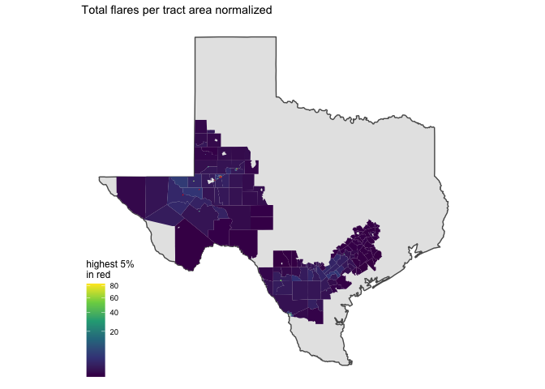

# flares

<!-- ```{python} -->
<!-- import wget -->
<!-- from zipfile import ZipFile -->
<!-- import os -->
<!-- url = 'https://www2.census.gov/geo/tiger/TIGER2016/TRACT/tl_2016_48_tract.zip' -->
<!-- wget.download(url, os.path.expanduser('~/tmp')) -->
<!-- file_name = os.path.expanduser('~/tmp/tl_2016_48_tract.zip') -->
<!-- ZipFile(file_name, 'r').extractall(os.path.expanduser('~/tmp/tl_2016_48_tract/')) -->
<!-- os.system("ls ~/tmp/tl_2016_48_tract/") -->
<!-- ``` -->

A total of 17,865 flares were reported in 2017.

Flares ocurred in a total of 61/ Exposure is defined as tracts within a
buffer of 5km from origin tract.

    ## although coordinates are longitude/latitude, st_intersects assumes that they are planar

## Total exposure to flares per tract

    ##        V1         
    ##  Min.   :    1.0  
    ##  1st Qu.:   29.5  
    ##  Median :  245.0  
    ##  Mean   :  708.8  
    ##  3rd Qu.:  593.0  
    ##  Max.   :10181.0  
    ##  NA's   :5058

## Total exposure to flares per tract area normalized

-   flares per sq km summary

<!-- -->

    ##        V1          
    ##  Min.   :   0.001  
    ##  1st Qu.:   0.147  
    ##  Median :   0.765  
    ##  Mean   :  27.639  
    ##  3rd Qu.:   4.881  
    ##  Max.   :1694.806  
    ##  NA's   :5058

-   highest 5% in red

<!-- -->

<!-- ```{r} -->
<!-- library(leaflet) -->
<!-- xx <- tracts_sf %>%  -->
<!--   filter(norm_exposure > 80) -->
<!-- pal <- colorNumeric( -->
<!--   palette = "viridis", -->
<!--   domain = xx$norm_exposure) -->
<!-- leaflet() %>%  -->
<!--   addProviderTiles(providers$OpenStreetMap) %>%  -->
<!--   addPolygons(data = xx[,c("norm_exposure", "geometry")],  -->
<!--               fillColor = ~pal(xx$norm_exposure),  -->
<!--               weight = 0.5, -->
<!--               opacity = 0.5, -->
<!--               color = "white", -->
<!--               dashArray = "3", -->
<!--               fillOpacity = 0.7)  -->
<!-- ``` -->
