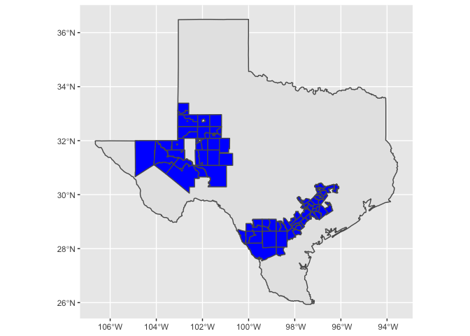
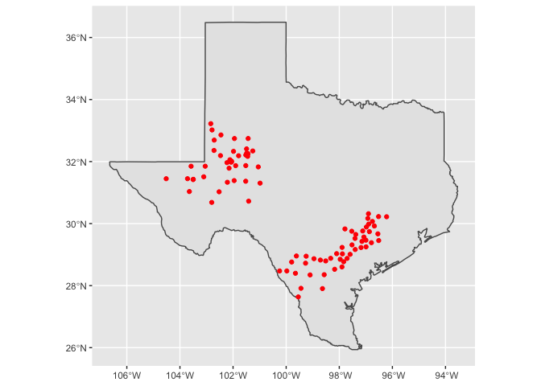

# disperser_input

This scripts creates the input dataset for our disperseR simulations.


* Read fracking well data


```r
input <- read_csv("../data/input/tx-tracts-vnf-nightly.csv")
```

```
## Rows: 37511 Columns: 6
```

```
## ── Column specification ────────────────────────────────────────────────────────
## Delimiter: ","
## chr  (2): COUNTYFP, TRACTCE
## dbl  (3): STATEFP, GEOID, flares
## date (1): date
```

```
## 
## ℹ Use `spec()` to retrieve the full column specification for this data.
## ℹ Specify the column types or set `show_col_types = FALSE` to quiet this message.
```

```r
input %<>%
  mutate(STATEFP = as.character(STATEFP), 
         #COUNTYFP = as.character(COUNTYFP), 
         #TRACTCE = as.character(TRACTCE),
         GEOID = as.character(GEOID)) %>% 
  rename(flares_per_day = flares)
head(input)
```

```
## # A tibble: 6 × 6
##   STATEFP COUNTYFP TRACTCE GEOID       date       flares_per_day
##   <chr>   <chr>    <chr>   <chr>       <date>              <dbl>
## 1 48      013      960100  48013960100 2015-07-01              2
## 2 48      013      960100  48013960100 2015-07-04              2
## 3 48      013      960100  48013960100 2015-07-10              1
## 4 48      013      960100  48013960100 2015-07-11              1
## 5 48      013      960100  48013960100 2015-07-23              1
## 6 48      013      960100  48013960100 2015-08-29              1
```


```r
summary(input) 
```

```
##    STATEFP            COUNTYFP           TRACTCE             GEOID          
##  Length:37511       Length:37511       Length:37511       Length:37511      
##  Class :character   Class :character   Class :character   Class :character  
##  Mode  :character   Mode  :character   Mode  :character   Mode  :character  
##                                                                             
##                                                                             
##                                                                             
##       date            flares_per_day  
##  Min.   :2015-07-01   Min.   : 1.000  
##  1st Qu.:2017-08-23   1st Qu.: 1.000  
##  Median :2018-11-20   Median : 2.000  
##  Mean   :2018-09-03   Mean   : 5.125  
##  3rd Qu.:2019-11-18   3rd Qu.: 6.000  
##  Max.   :2020-12-30   Max.   :93.000
```

* Get centroids


```r
states_sf <- st_as_sf(map("state", plot = FALSE, fill = TRUE))
head(states_sf)
```

```
## Simple feature collection with 6 features and 1 field
## geometry type:  MULTIPOLYGON
## dimension:      XY
## bbox:           xmin: -124.3834 ymin: 30.24071 xmax: -71.78015 ymax: 42.04937
## geographic CRS: WGS 84
##            ID                           geom
## 1     alabama MULTIPOLYGON (((-87.46201 3...
## 2     arizona MULTIPOLYGON (((-114.6374 3...
## 3    arkansas MULTIPOLYGON (((-94.05103 3...
## 4  california MULTIPOLYGON (((-120.006 42...
## 5    colorado MULTIPOLYGON (((-102.0552 4...
## 6 connecticut MULTIPOLYGON (((-73.49902 4...
```

```r
crs_ <- st_crs(states_sf)
```

<!-- ```{python} -->
<!-- import wget -->
<!-- from zipfile import ZipFile -->
<!-- import os -->

<!-- url = 'https://www2.census.gov/geo/tiger/TIGER2016/TRACT/tl_2016_48_tract.zip' -->
<!-- wget.download(url, os.path.expanduser('~/tmp')) -->
<!-- file_name = os.path.expanduser('~/tmp/tl_2016_48_tract.zip') -->
<!-- ZipFile(file_name, 'r').extractall(os.path.expanduser('~/tmp/tl_2016_48_tract/')) -->
<!-- os.system("ls ~/tmp/tl_2016_48_tract/") -->
<!-- ``` -->


```r
geoid_ <- unique(input$GEOID)
centroids_sf <- tracts_sf %>% 
  filter(GEOID %in% geoid_)
head(centroids_sf)
```

```
## Simple feature collection with 6 features and 12 fields
## geometry type:  POLYGON
## dimension:      XY
## bbox:           xmin: -103.5851 ymin: 29.71285 xmax: -96.08084 ymax: 32.08753
## geographic CRS: WGS 84
##   STATEFP COUNTYFP TRACTCE       GEOID NAME          NAMELSAD MTFCC FUNCSTAT
## 1      48      371  950100 48371950100 9501 Census Tract 9501 G5020        S
## 2      48      371  950500 48371950500 9505 Census Tract 9505 G5020        S
## 3      48      477  170600 48477170600 1706 Census Tract 1706 G5020        S
## 4      48      477  170500 48477170500 1705 Census Tract 1705 G5020        S
## 5      48      173  950100 48173950100 9501 Census Tract 9501 G5020        S
## 6      48      055  960500 48055960500 9605 Census Tract 9605 G5020        S
##        ALAND   AWATER    INTPTLAT     INTPTLON                       geometry
## 1 3506966481  2360329 +31.1856232 -102.8789156 POLYGON ((-103.2535 31.1171...
## 2 8817585913   171946 +30.6781932 -102.7986785 POLYGON ((-103.5813 30.7705...
## 3  514020359 10442329 +30.2277955 -096.2145460 POLYGON ((-96.35858 30.1413...
## 4  792653251 32575050 +30.2242031 -096.5262454 POLYGON ((-96.79455 30.1605...
## 5 2331552973  2245301 +31.8680062 -101.5214944 POLYGON ((-101.7761 32.0869...
## 6  231665215  1633627 +29.8316191 -097.7886427 POLYGON ((-97.89922 29.8578...
```


```r
ggplot() + 
  geom_sf(data = filter(states_sf, ID == "texas")) + 
  geom_sf(data = centroids_sf, fill = "blue")
```

<!-- -->


```r
centroids_sf <- centroids_sf %>% 
  st_centroid(centroids_sf)
```

```
## Warning in st_centroid.sf(., centroids_sf): st_centroid assumes attributes are
## constant over geometries of x
```

```
## Warning in st_centroid.sfc(st_geometry(x), of_largest_polygon =
## of_largest_polygon): st_centroid does not give correct centroids for longitude/
## latitude data
```

```r
ggplot() + 
  geom_sf(data = filter(states_sf, ID == "texas")) + 
  geom_sf(data = centroids_sf, color = "red")
```

<!-- -->


```r
coords <- as_tibble(st_coordinates(centroids_sf)) %>% 
  rename(Latitude = Y, 
         Longitude = X)
centroids_sf <- bind_cols(centroids_sf, coords)
head(centroids_sf)
```

```
## Simple feature collection with 6 features and 14 fields
## geometry type:  POINT
## dimension:      XY
## bbox:           xmin: -102.8028 ymin: 29.82843 xmax: -96.21782 ymax: 31.86946
## geographic CRS: WGS 84
##   STATEFP COUNTYFP TRACTCE       GEOID NAME          NAMELSAD MTFCC FUNCSTAT
## 1      48      371  950100 48371950100 9501 Census Tract 9501 G5020        S
## 2      48      371  950500 48371950500 9505 Census Tract 9505 G5020        S
## 3      48      477  170600 48477170600 1706 Census Tract 1706 G5020        S
## 4      48      477  170500 48477170500 1705 Census Tract 1705 G5020        S
## 5      48      173  950100 48173950100 9501 Census Tract 9501 G5020        S
## 6      48      055  960500 48055960500 9605 Census Tract 9605 G5020        S
##        ALAND   AWATER    INTPTLAT     INTPTLON  Longitude Latitude
## 1 3506966481  2360329 +31.1856232 -102.8789156 -102.52463 31.02560
## 2 8817585913   171946 +30.6781932 -102.7986785 -102.80276 30.68323
## 3  514020359 10442329 +30.2277955 -096.2145460  -96.21782 30.22073
## 4  792653251 32575050 +30.2242031 -096.5262454  -96.52034 30.22643
## 5 2331552973  2245301 +31.8680062 -101.5214944 -101.52080 31.86946
## 6  231665215  1633627 +29.8316191 -097.7886427  -97.78664 29.82843
##                     geometry
## 1  POINT (-102.5246 31.0256)
## 2 POINT (-102.8028 30.68323)
## 3 POINT (-96.21782 30.22073)
## 4 POINT (-96.52034 30.22643)
## 5 POINT (-101.5208 31.86946)
## 6 POINT (-97.78664 29.82843)
```

* Prepare input data for disperser


```r
input %<>% 
  left_join(centroids_sf %>% 
              st_drop_geometry() %>% 
              select(GEOID, Latitude, Longitude))
```

```
## Joining, by = "GEOID"
```

```r
start_hour_ <- lapply(input$flares_per_day, function(x) floor(seq(6,17,12/x)))
input$start_hour = start_hour_
input <- unnest(input, cols = c(start_hour))
head(input)
```

```
## # A tibble: 6 × 9
##   STATEFP COUNTYFP TRACTCE GEOID       date       flares_per_day Latitude Longitude
##   <chr>   <chr>    <chr>   <chr>       <date>              <dbl>    <dbl>     <dbl>
## 1 48      013      960100  48013960100 2015-07-01              2     28.9     -98.3
## 2 48      013      960100  48013960100 2015-07-01              2     28.9     -98.3
## 3 48      013      960100  48013960100 2015-07-04              2     28.9     -98.3
## 4 48      013      960100  48013960100 2015-07-04              2     28.9     -98.3
## 5 48      013      960100  48013960100 2015-07-10              1     28.9     -98.3
## 6 48      013      960100  48013960100 2015-07-11              1     28.9     -98.3
## # … with 1 more variable: start_hour <dbl>
```


```r
dim(input)
```

```
## [1] 186969      9
```

```r
input %<>% 
  group_by_all() %>% 
  summarise(n = n())
```

```
## `summarise()` has grouped output by 'STATEFP', 'COUNTYFP', 'TRACTCE', 'GEOID', 'date', 'flares_per_day', 'Latitude', 'Longitude'. You can override using the `.groups` argument.
```

```r
dim(input)
```

```
## [1] 150302     10
```


```r
write_rds(input, "../data/input/input.rds")
```


```r
#number of simulations per year-month
input %>% 
  group_by(year(date), month(date)) %>% 
  summarise(n_sim = n(), 
            n_flares = sum(n))
```

```
## `summarise()` has grouped output by 'year(date)'. You can override using the `.groups` argument.
```

```
## # A tibble: 66 × 4
## # Groups:   year(date) [6]
##    `year(date)` `month(date)` n_sim n_flares
##           <dbl>         <dbl> <int>    <int>
##  1         2015             7  1647     1804
##  2         2015             8  1736     1890
##  3         2015             9  1844     2020
##  4         2015            10  1424     1533
##  5         2015            11  1364     1554
##  6         2015            12  1667     2289
##  7         2016             1  1611     2304
##  8         2016             2  1680     2342
##  9         2016             3  1409     1818
## 10         2016             4  1171     1557
## # … with 56 more rows
```
