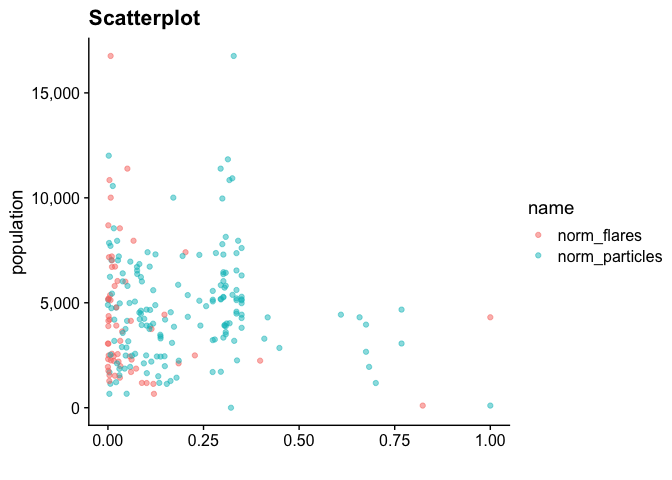
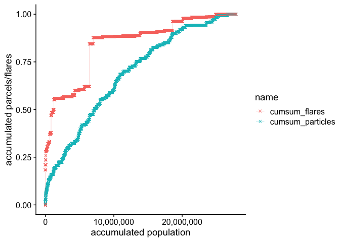

# exposure


<!-- ```{python} -->
<!-- import wget -->
<!-- from zipfile import ZipFile -->
<!-- import os -->

<!-- url = 'https://www2.census.gov/geo/tiger/TIGER2016/TRACT/tl_2016_48_tract.zip' -->
<!-- wget.download(url, os.path.expanduser('~/tmp')) -->
<!-- file_name = os.path.expanduser('~/tmp/tl_2016_48_tract.zip') -->
<!-- ZipFile(file_name, 'r').extractall(os.path.expanduser('~/tmp/tl_2016_48_tract/')) -->
<!-- os.system("ls ~/tmp/tl_2016_48_tract/") -->
<!-- ``` -->


## Cap exposure

Exposed population is considered to be people living in tracks that accumulated more than 7500 particles in a year.

<!-- -->

<!-- -->

<!-- ```{r, include=FALSE} -->
<!-- myPalette <- colorRampPalette(rev(brewer.pal(11, "Spectral"))) -->
<!-- sc <- scale_fill_gradientn(colours = myPalette(100),  -->
<!--                              limits=c(min(tot_particles_, na.rm = T),  -->
<!--                                       max(tot_particles_, na.rm = T))) -->
<!-- cbsa_ <- tracts_sf %>%  -->
<!--   st_drop_geometry() %>%  -->
<!--   mutate(exposed = (!is.na(tot_particles)),  -->
<!--          exposed_pop = pop * exposed) %>%  -->
<!--   group_by(cbsa, cbsa_name, pop_cbsa) %>%  -->
<!--   summarise(tot_particles = sum(tot_particles, na.rm = T),  -->
<!--             exposed_pop = sum(exposed_pop), -->
<!--             n = n(),  -->
<!--             exposed = sum(exposed)) %>%  -->
<!--   filter(tot_particles > 0) %>% -->
<!--   arrange(desc(pop_cbsa)) -->

<!-- cbsa_particles_map <- list() -->

<!-- for(i in 1:nrow(cbsa_)) { -->
<!--   xx <- tracts_sf %>%  -->
<!--     filter(cbsa == cbsa_$cbsa[i]) -->

<!--   pa1 <- xx %>%  -->
<!--     ggplot() +  -->
<!--     geom_sf(data = filter(states_sf, ID == "texas")) +  -->
<!--     geom_sf(aes(fill = tot_particles), colour = NA, lwd = 0) + -->
<!--     theme_map() +  -->
<!--     theme(legend.position = "left") +  -->
<!--     sc +  -->
<!--     labs(title = cbsa_$cbsa_name[i],  -->
<!--          subtitle = paste("total particles:",  -->
<!--                           prettyNum(cbsa_$tot_particles[i], big.mark = ",")), -->
<!--          fill = "total\nparticles") -->

<!--   pa2 <- xx %>%  -->
<!--     ggplot() +  -->
<!--     geom_sf(aes(fill = tot_particles), colour = NA, lwd = 0) + -->
<!--     theme_map() +  -->
<!--     theme(legend.position = "none") +  -->
<!--     sc  +  -->
<!--     labs(subtitle = paste("number of tracts:",  -->
<!--                           prettyNum(cbsa_$n[i], big.mark = ","),  -->
<!--                           "\nnumber of exposed tracts:",  -->
<!--                           prettyNum(cbsa_$exposed[i], big.mark = ","))) -->

<!--   pa <- plot_grid(pa1, pa2, ncol = 2) -->

<!--   pb <- xx %>%   -->
<!--     mutate(tot_particles = if_else(is.na(tot_particles), 0, tot_particles)) %>%  -->
<!--     arrange(tot_particles, pop) %>%  -->
<!--     mutate(cumsum_pop = cumsum(pop),  -->
<!--            cumsum_particles = cumsum(tot_particles)) %>%  -->
<!--   ggplot() +  -->
<!--     geom_point(aes(x=cumsum_pop, y = cumsum_particles), color = "blue",  -->
<!--                size = 0.5, shape = 4) +  -->
<!--     geom_line(aes(x=cumsum_pop, y = cumsum_particles), size = 0.1) +  -->
<!--     theme_cowplot() +  -->
<!--     labs(subtitle = paste("total population:",  -->
<!--                           prettyNum(cbsa_$pop_cbsa[i], big.mark = ","),  -->
<!--                           "\nexposed population:",  -->
<!--                           prettyNum(cbsa_$exposed_pop[i], big.mark = ",")),  -->
<!--          y = "accumulated particles",  -->
<!--          x = "accumulated population") +  -->
<!--     scale_y_continuous(labels = scales::label_number(accuracy = 1, big.mark = ',')) +  -->
<!--     scale_x_continuous(labels = scales::label_number(accuracy = 1, big.mark = ',')) -->

<!--   cbsa_particles_map[[i]] <- plot_grid(pa, pb, nrow = 2) -->
<!-- } -->
<!-- cbsa_particles_map <- marrangeGrob(cbsa_particles_map,  -->
<!--                            nrow = 2, ncol = 1,  -->
<!--                            left = "", top = "") -->
<!-- ggsave("./concentration_output/cbsa_particles_map.pdf",  -->
<!--        cbsa_particles_map, width = 15, height = 25, units = "cm") -->
<!-- ``` -->
