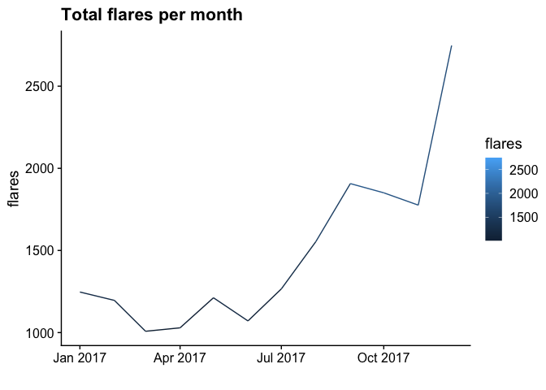
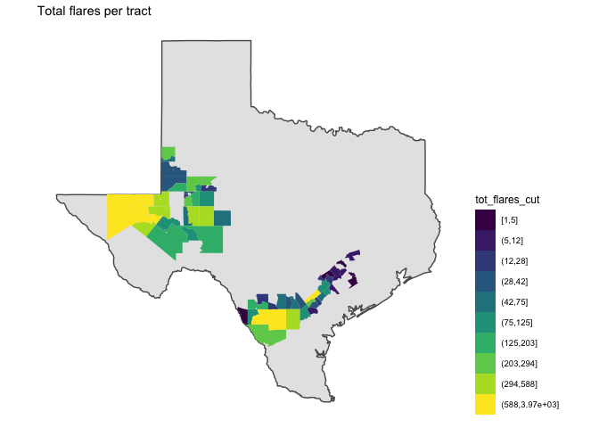
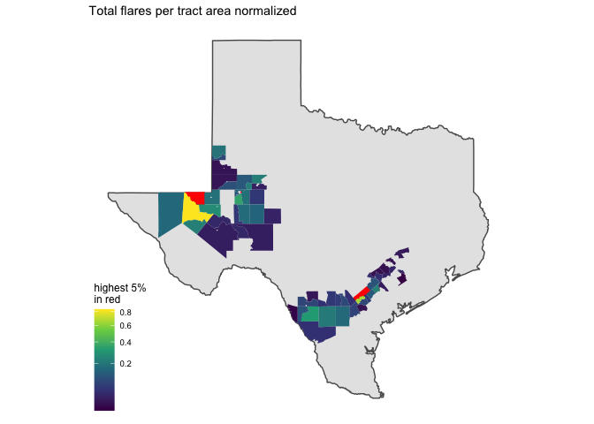
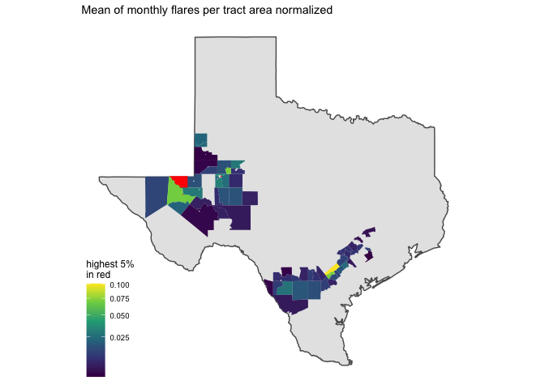
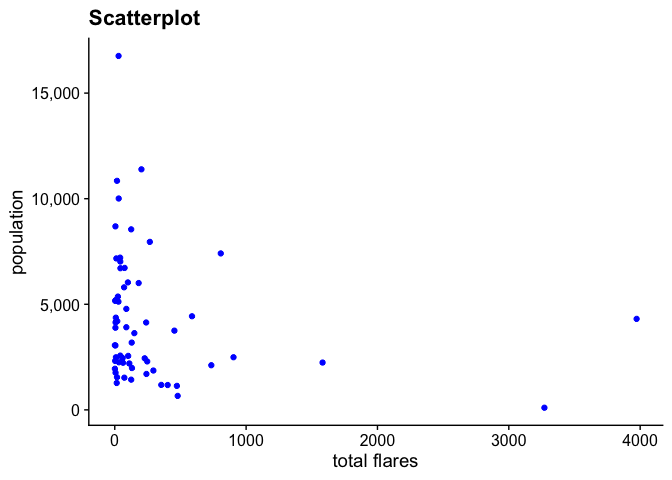
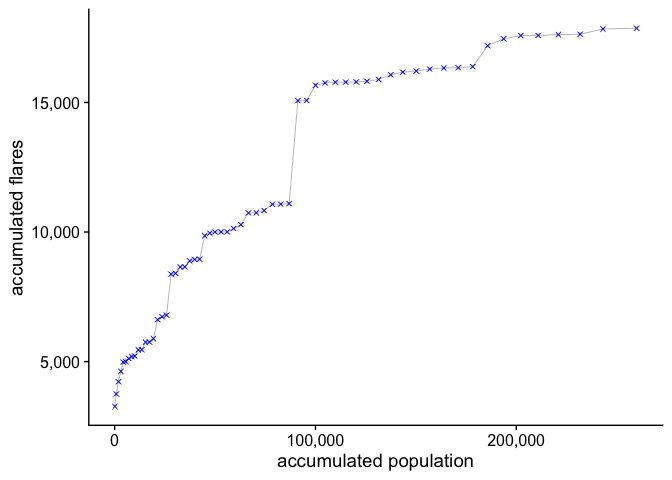

# flares


<!-- ```{python} -->
<!-- import wget -->
<!-- from zipfile import ZipFile -->
<!-- import os -->

<!-- url = 'https://www2.census.gov/geo/tiger/TIGER2016/TRACT/tl_2016_48_tract.zip' -->
<!-- wget.download(url, os.path.expanduser('~/tmp')) -->
<!-- file_name = os.path.expanduser('~/tmp/tl_2016_48_tract.zip') -->
<!-- ZipFile(file_name, 'r').extractall(os.path.expanduser('~/tmp/tl_2016_48_tract/')) -->
<!-- os.system("ls ~/tmp/tl_2016_48_tract/") -->
<!-- ``` -->


A total of 17,865 flares were reported in 2017.

A total of 61 tracts were exposed.

## Total flares per month time series

<!-- -->

## Total flares per tract

* total flares summary


```
##    Min. 1st Qu.  Median    Mean 3rd Qu.    Max.    NA's 
##     1.0    17.0    75.0   292.9   241.0  3973.0    5204
```

* Color scheme in deciles.

<!-- -->

## Total flares per tract area normalized

* flares per sq km summary


```
##    Min. 1st Qu.  Median    Mean 3rd Qu.    Max.    NA's 
##   0.001   0.026   0.085   0.179   0.186   1.889    5204
```

* highest 5% in red

<!-- -->

## Monthly flares per tract area normalized

* summary


```
## Joining, by = "GEOID"
```

```
##      Min.   1st Qu.    Median      Mean   3rd Qu.      Max. 
## 0.0001134 0.0092148 0.0167659 0.0352295 0.0379501 0.8634279
```


## Monthly mean flares per tract area summarised

* summary


```
## Joining, by = "GEOID"
```

```
##    Min. 1st Qu.  Median    Mean 3rd Qu.    Max.    NA's 
##   0.001   0.006   0.012   0.038   0.024   0.863    5204
```


<!-- -->

## Cap exposure to flares

A total of 259,948 people live in tracts where flares events occurred.

In general, tracts with higher number of flares are less populated. 

<!-- -->

<!-- -->


<!-- ```{r} -->
<!-- tracts_sf %>%  -->
<!--   filter(!is.na(tot_flares)) %>%  -->
<!--   arrange(pop_cbsa) %>%  -->
<!--   mutate(cumsum_pop = cumsum(pop),  -->
<!--          cumsum_flares = cumsum(tot_flares)) %>%  -->
<!-- ggplot() +  -->
<!--   geom_point(aes(x=cumsum_flares, cumsum_pop, color = cbsa_name)) + -->
<!--   geom_line(aes(x=cumsum_flares, cumsum_pop)) -->
<!-- ``` -->


<!-- ```{r, include=FALSE} -->
<!-- flares_cbsa <- flares %>% -->
<!--   group_by(yyyy_mm, cbsa) %>% -->
<!--   summarise(flares = sum(flares)) -->
<!-- myPalette <- colorRampPalette(rev(brewer.pal(11, "Spectral"))) -->
<!-- sc <- scale_color_gradientn(colours = myPalette(100), -->
<!--                              limits=c(min(flares_cbsa$flares), -->
<!--                                       max(flares_cbsa$flares))) -->

<!-- cbsa_flares_ts <- list() -->
<!-- cbsa_sf %<>% -->
<!--   arrange(desc(flares_per_cap)) -->
<!-- #i = 1 -->
<!-- for(i in 1:nrow(cbsa_sf)) { -->
<!--   cbsa_ <- cbsa_sf$cbsa[i] -->
<!--   cbsa_name_ <- cbsa_sf$cbsa_name[i] -->
<!--   flares_per_cap_ <- cbsa_sf$flares_per_cap[i] -->

<!--   map <- cbsa_sf %>% -->
<!--     filter(cbsa == cbsa_) %>% -->
<!--     ggplot() + -->
<!--     geom_sf(data = filter(states_sf, ID == "texas")) + -->
<!--     geom_sf(aes(fill = cbsa_)) + -->
<!--     theme_map() + -->
<!--     theme(legend.position = "none") + -->
<!--     labs(title = "flares per cap:", -->
<!--          subtitle = round(flares_per_cap_, digits = 2)) -->

<!--   ts <- flares_cbsa %>% -->
<!--     filter(cbsa == cbsa_) %>% -->
<!--     ggplot() + -->
<!--     geom_point(aes(x = ym(yyyy_mm), y = flares, color = flares)) + -->
<!--     geom_line(aes(x = ym(yyyy_mm), y = flares, color = flares)) + -->
<!--     sc + -->
<!--     theme_cowplot() + -->
<!--     xlim(c(min(ym(flares_cbsa$yyyy_mm)), max(ym(flares_cbsa$yyyy_mm)))) + -->
<!--     theme(legend.position = "none") + -->
<!--     labs(title = cbsa_name_, x = "") -->

<!--   cbsa_flares_ts[[i]] <- plot_grid(map, ts, ncol = 2, rel_widths = c(0.2, 0.8)) -->
<!-- } -->
<!-- cbsa_flares_ts <- marrangeGrob(cbsa_flares_ts, -->
<!--                            nrow = 3, ncol = 1, -->
<!--                            left = "", top = "CBSA's sorted by flares per capita") -->
<!-- ggsave("./flares_output/cbsa_flares_ts.pdf", -->
<!--        cbsa_flares_ts, width = 15, height = 25, units = "cm") -->
<!-- ``` -->
