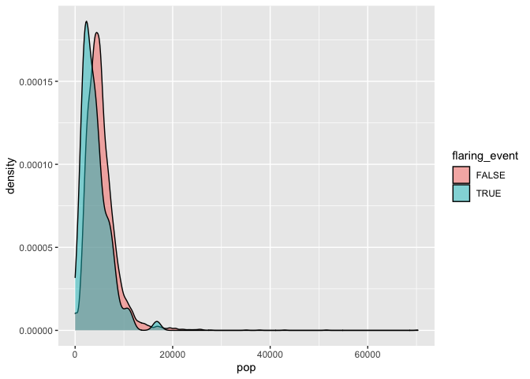
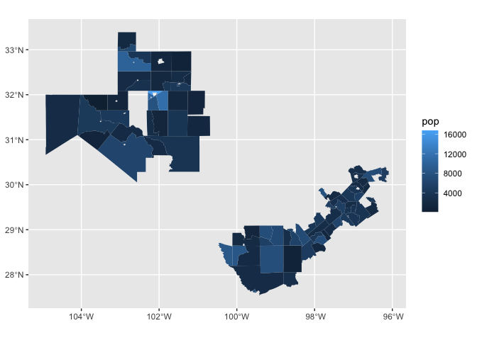
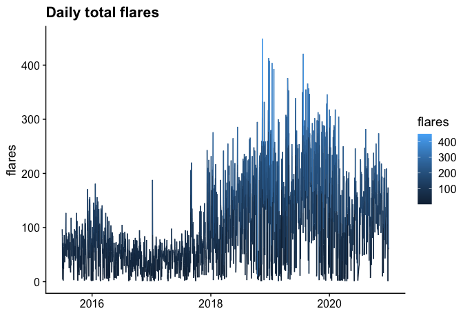
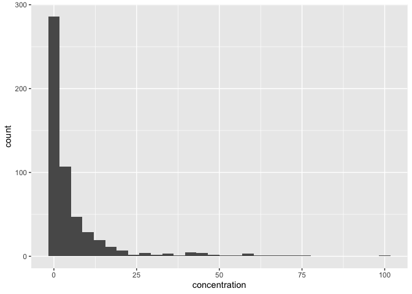
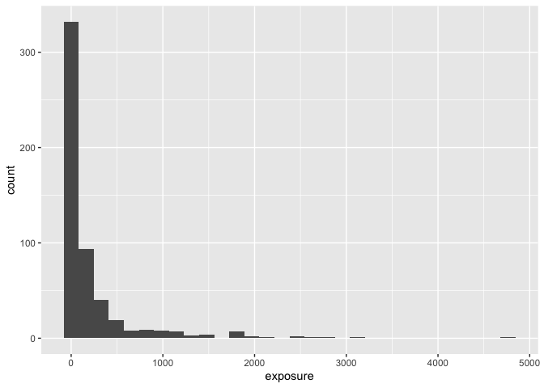
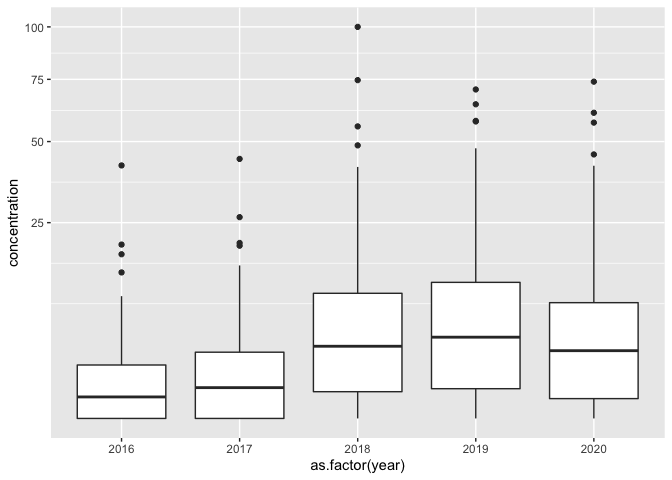
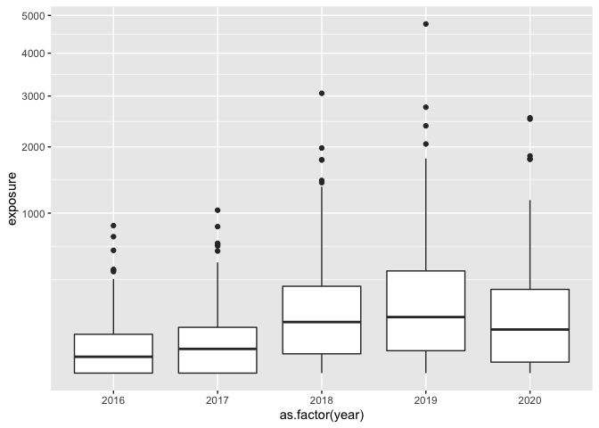
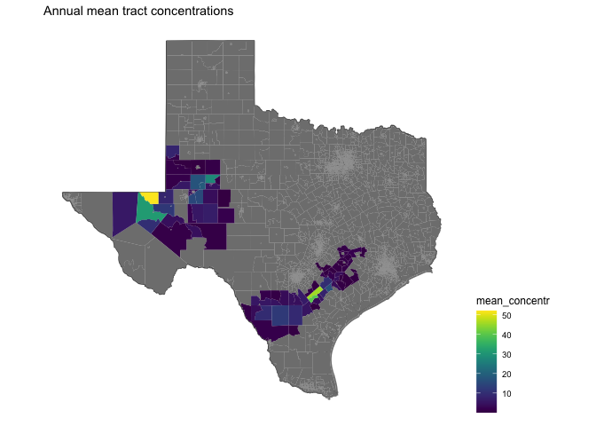
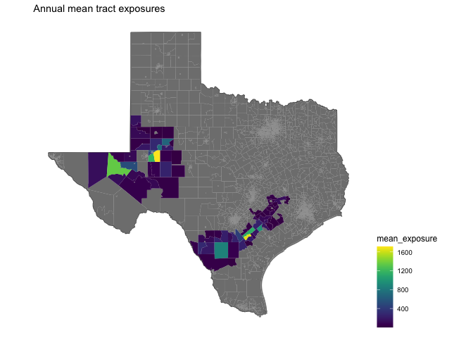

# flares


<!-- ```{python} -->
<!-- import wget -->
<!-- from zipfile import ZipFile -->
<!-- import os -->

<!-- url = 'https://www2.census.gov/geo/tiger/TIGER2016/TRACT/tl_2016_48_tract.zip' -->
<!-- wget.download(url, os.path.expanduser('~/tmp')) -->
<!-- file_name = os.path.expanduser('~/tmp/tl_2016_48_tract.zip') -->
<!-- ZipFile(file_name, 'r').extractall(os.path.expanduser('~/tmp/tl_2016_48_tract/')) -->
<!-- os.system("ls ~/tmp/tl_2016_48_tract/") -->
<!-- ``` -->


```
## Joining, by = "GEOID"
```

## Tract population

Census tracts are small, relatively permanent statistical subdivisions of a county.

Census tracts average about 4,000
inhabitants
– Minimum Population – 1,200
– Maximum Population – 8,000

<!-- -->

<!-- -->

## Area per tract


```
##     Min.  1st Qu.   Median     Mean  3rd Qu.     Max. 
##    2.692  371.471  748.264 1343.542 1707.997 9873.440
```


```
##  [1] NA NA NA NA NA NA NA NA NA NA NA NA
```


## Daily flares

A total of 192,253 flares were reported between Jul 2015 and Dec 2020.

<!-- -->

A total of 90 tracts were exposed between Jul 2015 and Dec 2020 to flaring. 

## No wind concentration and exposure

We trace parcels of air that contain emissions of flaring events. First we consider the case where air parcels are not affected by wind, that is  emissions remain in the census tracts where flaring occurs.

As a concentration measure to distinguish air parcels that are more spread in larger areas and denser in smaller areas, we divide the number of air parcels by the census track area.

Specifically, we trace 100 parcels of air containing pollutants for 12 hours after any flaring event and define flaring pollution density as the number of traced parcels lingering in a track divided the census track area (in sq km2). 


```
## Joining, by = "date"
## Joining, by = "date"
## Joining, by = "date"
## Joining, by = "date"
## Joining, by = "date"
## Joining, by = "date"
## Joining, by = "date"
## Joining, by = "date"
## Joining, by = "date"
## Joining, by = "date"
## Joining, by = "date"
## Joining, by = "date"
## Joining, by = "date"
## Joining, by = "date"
## Joining, by = "date"
## Joining, by = "date"
## Joining, by = "date"
## Joining, by = "date"
## Joining, by = "date"
## Joining, by = "date"
## Joining, by = "date"
## Joining, by = "date"
## Joining, by = "date"
## Joining, by = "date"
## Joining, by = "date"
## Joining, by = "date"
## Joining, by = "date"
## Joining, by = "date"
## Joining, by = "date"
## Joining, by = "date"
## Joining, by = "date"
## Joining, by = "date"
## Joining, by = "date"
## Joining, by = "date"
## Joining, by = "date"
## Joining, by = "date"
## Joining, by = "date"
## Joining, by = "date"
## Joining, by = "date"
## Joining, by = "date"
## Joining, by = "date"
## Joining, by = "date"
## Joining, by = "date"
## Joining, by = "date"
## Joining, by = "date"
## Joining, by = "date"
## Joining, by = "date"
## Joining, by = "date"
## Joining, by = "date"
## Joining, by = "date"
## Joining, by = "date"
## Joining, by = "date"
## Joining, by = "date"
## Joining, by = "date"
## Joining, by = "date"
## Joining, by = "date"
## Joining, by = "date"
## Joining, by = "date"
## Joining, by = "date"
## Joining, by = "date"
## Joining, by = "date"
## Joining, by = "date"
## Joining, by = "date"
## Joining, by = "date"
## Joining, by = "date"
## Joining, by = "date"
## Joining, by = "date"
## Joining, by = "date"
## Joining, by = "date"
## Joining, by = "date"
## Joining, by = "date"
## Joining, by = "date"
## Joining, by = "date"
## Joining, by = "date"
## Joining, by = "date"
## Joining, by = "date"
## Joining, by = "date"
## Joining, by = "date"
## Joining, by = "date"
## Joining, by = "date"
## Joining, by = "date"
## Joining, by = "date"
## Joining, by = "date"
## Joining, by = "date"
## Joining, by = "date"
## Joining, by = "date"
## Joining, by = "date"
## Joining, by = "date"
## Joining, by = "date"
## Joining, by = "date"
```

```
## Joining, by = "GEOID"
```


```
## `summarise()` has grouped output by 'year', 'GEOID'. You can override using the `.groups` argument.
```

```
##    Min. 1st Qu.  Median    Mean 3rd Qu.    Max. 
##    0.00    0.00   64.05  290.28  270.10 5158.38
```

```
##    Min. 1st Qu.  Median    Mean 3rd Qu.    Max. 
##  0.0000  0.0000  0.1946  0.8354  0.8035 14.1325
```

```
##    Min. 1st Qu.  Median    Mean 3rd Qu.    Max. 
##  0.0000  0.0000  0.0000  0.4121  0.0000 11.7779
```

```
##    Min. 1st Qu.  Median    Mean 3rd Qu.    Max. 
##   0.000   0.000   1.377   5.911   5.685 100.000
```

```
##    Min. 1st Qu.  Median    Mean 3rd Qu.    Max. 
##    0.00    0.00   43.45  216.28  203.73 4763.07
```


```
## `stat_bin()` using `bins = 30`. Pick better value with `binwidth`.
```

<!-- -->


```
## `stat_bin()` using `bins = 30`. Pick better value with `binwidth`.
```

<!-- -->

Census tract boundaries are defined in such a way that their population averages 4,000 residents, therefore per tract measurements are loosely population normalized measures. As such, the concentration score per tract translates broadly to a score per 4,000 residents. Between 2016 and 2020 the median concentration scores per track increased from 0.3 to 3, that is the median exposure of the population increased 10 times.


```
## $`2015`
##    Min. 1st Qu.  Median    Mean 3rd Qu.    Max. 
##  0.0000  0.0000  0.4276  3.4456  2.9639 52.3335 
## 
## $`2016`
##    Min. 1st Qu.  Median    Mean 3rd Qu.    Max. 
##  0.0000  0.0000  0.3017  2.2356  1.8629 41.7498 
## 
## $`2017`
##    Min. 1st Qu.  Median    Mean 3rd Qu.    Max. 
##  0.0000  0.0000  0.6185  2.8172  2.8618 43.9325 
## 
## $`2018`
##     Min.  1st Qu.   Median     Mean  3rd Qu.     Max. 
##   0.0000   0.4664   3.3990   8.9572  10.2151 100.0000 
## 
## $`2019`
##    Min. 1st Qu.  Median    Mean 3rd Qu.    Max. 
##  0.0000  0.5784  4.3107 10.2494 12.0782 70.5871 
## 
## $`2020`
##    Min. 1st Qu.  Median    Mean 3rd Qu.    Max. 
##  0.0000  0.2564  2.9944  7.7615  8.7416 73.9777
```

<!-- -->


```
## $`2015`
##    Min. 1st Qu.  Median    Mean 3rd Qu.    Max. 
##    0.00    0.00   14.75  122.40   89.55 2165.56 
## 
## $`2016`
##    Min. 1st Qu.  Median    Mean 3rd Qu.    Max. 
##    0.00    0.00   10.44   72.52   58.89  849.66 
## 
## $`2017`
##    Min. 1st Qu.  Median    Mean 3rd Qu.    Max. 
##    0.00    0.00   22.86   99.61   81.89 1037.04 
## 
## $`2018`
##    Min. 1st Qu.  Median    Mean 3rd Qu.    Max. 
##    0.00   14.53  101.90  301.97  294.75 3059.00 
## 
## $`2019`
##    Min. 1st Qu.  Median    Mean 3rd Qu.    Max. 
##    0.00   19.61  122.69  402.68  408.15 4763.07 
## 
## $`2020`
##     Min.  1st Qu.   Median     Mean  3rd Qu.     Max. 
##    0.000    4.925   74.226  298.506  273.887 2546.758
```

<!-- -->


```
## Joining, by = "GEOID"
```

<!-- -->

<!-- -->
