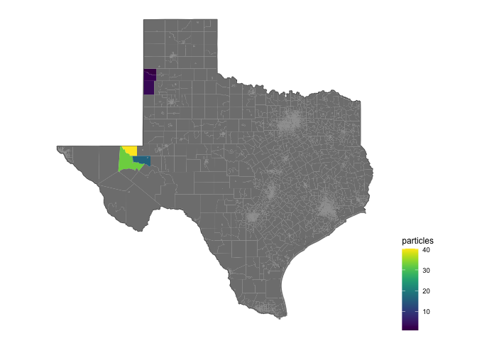
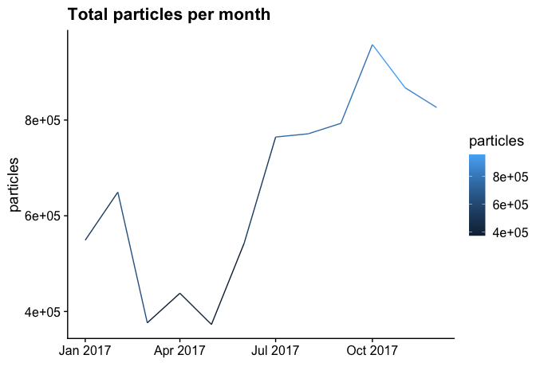
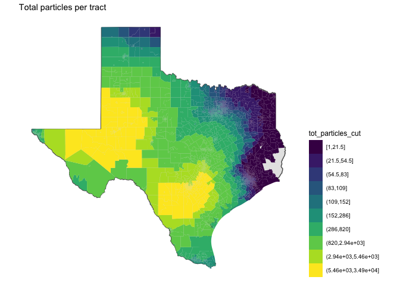
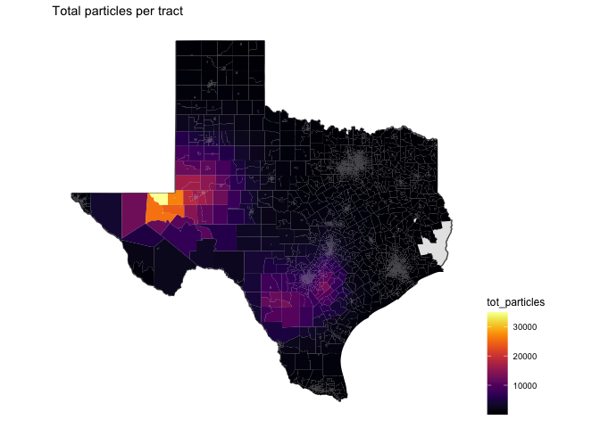
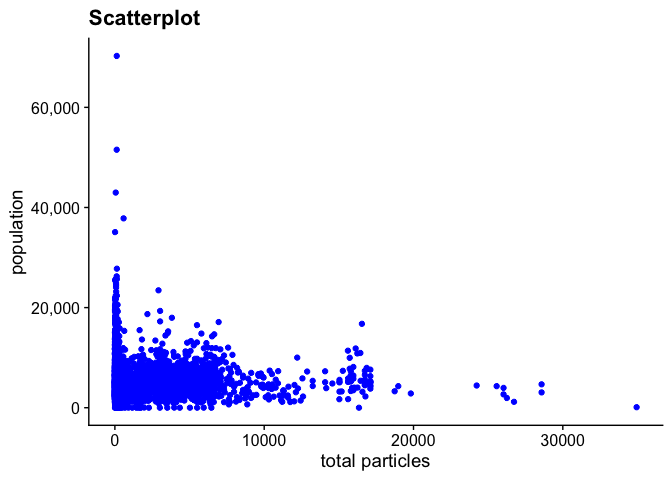
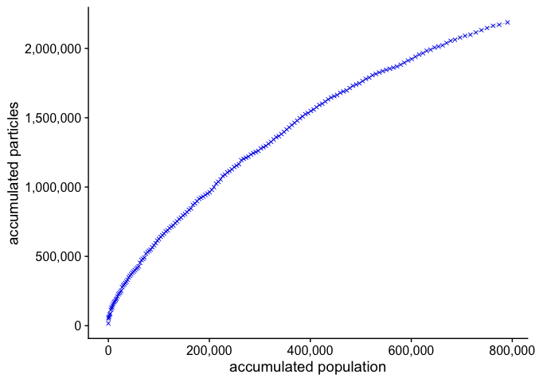

# particles


```
## [1] 0
```


<!-- ```{python} -->
<!-- import wget -->
<!-- from zipfile import ZipFile -->
<!-- import os -->

<!-- url = 'https://www2.census.gov/geo/tiger/TIGER2016/TRACT/tl_2016_48_tract.zip' -->
<!-- wget.download(url, os.path.expanduser('~/tmp')) -->
<!-- file_name = os.path.expanduser('~/tmp/tl_2016_48_tract.zip') -->
<!-- ZipFile(file_name, 'r').extractall(os.path.expanduser('~/tmp/tl_2016_48_tract/')) -->
<!-- os.system("ls ~/tmp/tl_2016_48_tract/") -->
<!-- ``` -->


```
## Joining, by = "GEOID"
```

Understand how particles are linked with input data


```
## # A tibble: 6 × 2
##   GEOID           n
##   <chr>       <int>
## 1 48089750200     1
## 2 48389950200     1
## 3 48149970200     3
## 4 48329001700     3
## 5 48089750500     5
## 6 48177000100     5
```


```
## # A tibble: 1 × 11
## # Groups:   STATEFP, COUNTYFP, TRACTCE, GEOID, date, flares_per_day, Latitude,
## #   Longitude [1]
##   STATEFP COUNTYFP TRACTCE GEOID       date       flares_per_day Latitude Longitude
##   <chr>   <chr>    <chr>   <chr>       <date>              <dbl>    <dbl>     <dbl>
## 1 48      089      750200  48089750200 2017-08-29              1     29.5     -96.5
## # … with 3 more variables: start_hour <dbl>, n <int>, year <dbl>
```

```
##    statefp countyfp state_name    name       GEOID particles month          ID
## 1       48      481         48    7411 48481741100  9.500000     8 48089750200
## 2       48      057         48       5 48057000500  6.421053     8 48089750200
## 3       48      469         48       8 48469000800  5.250000     8 48089750200
## 4       48      321         48    7307 48321730700  2.000000     8 48089750200
## 5       48      321         48 7305.01 48321730501  4.500000     8 48089750200
## 6       48      321         48    7306 48321730600  4.000000     8 48089750200
## 7       48      057         48       4 48057000400  9.444444     8 48089750200
## 8       48      057         48       3 48057000300 12.000000     8 48089750200
## 9       48      057         48       2 48057000200 10.000000     8 48089750200
## 10      48      057         48       1 48057000100 10.000000     8 48089750200
## 11      48      007         48    9501 48007950100  2.250000     8 48089750200
## 12      48      391         48    9504 48391950400  2.000000     8 48089750200
## 13      48      239         48    9503 48239950300 15.000000     8 48089750200
## 14      48      239         48    9502 48239950200 17.750000     8 48089750200
## 15      48      239         48    9501 48239950100 13.750000     8 48089750200
##                                comb year       date  pop        area
## 1  month: 20178 unitID :48089750200 2017 2017-08-01 2552  747.186777
## 2  month: 20178 unitID :48089750200 2017 2017-08-01 3720  732.697486
## 3  month: 20178 unitID :48089750200 2017 2017-08-01 1981  335.991711
## 4  month: 20178 unitID :48089750200 2017 2017-08-01 4613  796.558504
## 5  month: 20178 unitID :48089750200 2017 2017-08-01 3339  880.294331
## 6  month: 20178 unitID :48089750200 2017 2017-08-01 5398  446.746263
## 7  month: 20178 unitID :48089750200 2017 2017-08-01 6766  424.433205
## 8  month: 20178 unitID :48089750200 2017 2017-08-01 1641  142.552569
## 9  month: 20178 unitID :48089750200 2017 2017-08-01 4297    2.993481
## 10 month: 20178 unitID :48089750200 2017 2017-08-01 5383   10.030283
## 11 month: 20178 unitID :48089750200 2017 2017-08-01 5419  474.927616
## 12 month: 20178 unitID :48089750200 2017 2017-08-01 3562 1518.731200
## 13 month: 20178 unitID :48089750200 2017 2017-08-01 5075  399.959533
## 14 month: 20178 unitID :48089750200 2017 2017-08-01 4064  773.198840
## 15 month: 20178 unitID :48089750200 2017 2017-08-01 5681  975.088274
```


```
##  [1]  9.500000  6.421053  5.250000  2.000000  4.500000  4.000000  9.444444
##  [8] 12.000000 10.000000 10.000000  2.250000  2.000000 15.000000 17.750000
## [15] 13.750000
```

```
## [1] 123.8655
```


```
## Joining, by = c("GEOID", "area", "pop")
```

<!-- -->


```
## # A tibble: 1 × 11
## # Groups:   STATEFP, COUNTYFP, TRACTCE, GEOID, date, flares_per_day, Latitude,
## #   Longitude [1]
##   STATEFP COUNTYFP TRACTCE GEOID       date       flares_per_day Latitude Longitude
##   <chr>   <chr>    <chr>   <chr>       <date>              <dbl>    <dbl>     <dbl>
## 1 48      389      950200  48389950200 2017-09-22              1     31.4     -103.
## # … with 3 more variables: start_hour <dbl>, n <int>, year <dbl>
```

```
##   statefp countyfp state_name name       GEOID particles month          ID
## 1      48      389         48 9501 48389950100 32.500000     9 48389950200
## 2      48      475         48 9501 48475950100 16.000000     9 48389950200
## 3      48      017         48 9501 48017950100  3.142857     9 48389950200
## 4      48      369         48 9502 48369950200  1.000000     9 48389950200
## 5      48      369         48 9503 48369950300  2.500000     9 48389950200
## 6      48      301         48 9501 48301950100 40.200000     9 48389950200
##                               comb year       date  pop      area
## 1 month: 20179 unitID :48389950200 2017 2017-09-01 4309 4748.5822
## 2 month: 20179 unitID :48389950200 2017 2017-09-01 4434 2151.9073
## 3 month: 20179 unitID :48389950200 2017 2017-09-01 7092 2141.8472
## 4 month: 20179 unitID :48389950200 2017 2017-09-01 4861  919.0531
## 5 month: 20179 unitID :48389950200 2017 2017-09-01 4991 1362.2591
## 6 month: 20179 unitID :48389950200 2017 2017-09-01  102 1732.0594
```


```
## [1] 32.500000 16.000000  3.142857  1.000000  2.500000 40.200000
```

```
## [1] 95.34286
```


```
## Joining, by = c("GEOID", "area", "pop")
```

<!-- -->

A total of 7,908,398 particles were simulated.

A total of 5140 tracts were exposed.

## Total particles per month time series

<!-- -->

## Total particles per tract


Color scheme in deciles.

<!-- -->

Continuous gradient

<!-- -->

<!-- ## Monthly mean flares per tract -->

<!-- ```{r} -->
<!-- tracts_sf %>%  -->
<!--   left_join(flares %>%  -->
<!--               group_by(GEOID, yyyy_mm) %>%  -->
<!--               summarise(flares = sum(flares, na.rm = T)) %>%  -->
<!--               group_by(GEOID) %>%  -->
<!--               summarise(mu_flares = mean(flares, na.rm = T))) %>%  -->
<!--   filter(!is.na(mu_flares)) %>%  -->
<!-- ggplot() +  -->
<!--   geom_sf(data = filter(states_sf, ID == "texas")) +  -->
<!--   geom_sf(aes(fill = mu_flares), colour = NA, lwd = 0) + -->
<!--   theme_map() -->
<!-- ``` -->


## Cap exposure to particles

A total of 27,455,983 people live in tracts where simulated particles dispersed.

In general, tracts with higher number of particles are less populated. 

<!-- -->


Exposed population is considered to be people living in tracks that accumulated more than 7500 particles in a year. A total of 790,820 people were exposed.

<!-- -->


<!-- ```{r, include=FALSE} -->
<!-- flares_cbsa <- flares %>% -->
<!--   group_by(yyyy_mm, cbsa) %>% -->
<!--   summarise(flares = sum(flares)) -->
<!-- myPalette <- colorRampPalette(rev(brewer.pal(11, "Spectral"))) -->
<!-- sc <- scale_color_gradientn(colours = myPalette(100), -->
<!--                              limits=c(min(flares_cbsa$flares), -->
<!--                                       max(flares_cbsa$flares))) -->

<!-- cbsa_flares_ts <- list() -->
<!-- cbsa_sf %<>% -->
<!--   arrange(desc(flares_per_cap)) -->
<!-- #i = 1 -->
<!-- for(i in 1:nrow(cbsa_sf)) { -->
<!--   cbsa_ <- cbsa_sf$cbsa[i] -->
<!--   cbsa_name_ <- cbsa_sf$cbsa_name[i] -->
<!--   flares_per_cap_ <- cbsa_sf$flares_per_cap[i] -->

<!--   map <- cbsa_sf %>% -->
<!--     filter(cbsa == cbsa_) %>% -->
<!--     ggplot() + -->
<!--     geom_sf(data = filter(states_sf, ID == "texas")) + -->
<!--     geom_sf(aes(fill = cbsa_)) + -->
<!--     theme_map() + -->
<!--     theme(legend.position = "none") + -->
<!--     labs(title = "flares per cap:", -->
<!--          subtitle = round(flares_per_cap_, digits = 2)) -->

<!--   ts <- flares_cbsa %>% -->
<!--     filter(cbsa == cbsa_) %>% -->
<!--     ggplot() + -->
<!--     geom_point(aes(x = ym(yyyy_mm), y = flares, color = flares)) + -->
<!--     geom_line(aes(x = ym(yyyy_mm), y = flares, color = flares)) + -->
<!--     sc + -->
<!--     theme_cowplot() + -->
<!--     xlim(c(min(ym(flares_cbsa$yyyy_mm)), max(ym(flares_cbsa$yyyy_mm)))) + -->
<!--     theme(legend.position = "none") + -->
<!--     labs(title = cbsa_name_, x = "") -->

<!--   cbsa_flares_ts[[i]] <- plot_grid(map, ts, ncol = 2, rel_widths = c(0.2, 0.8)) -->
<!-- } -->
<!-- cbsa_flares_ts <- marrangeGrob(cbsa_flares_ts, -->
<!--                            nrow = 3, ncol = 1, -->
<!--                            left = "", top = "CBSA's sorted by flares per capita") -->
<!-- ggsave("./flares_output/cbsa_flares_ts.pdf", -->
<!--        cbsa_flares_ts, width = 15, height = 25, units = "cm") -->
<!-- ``` -->
