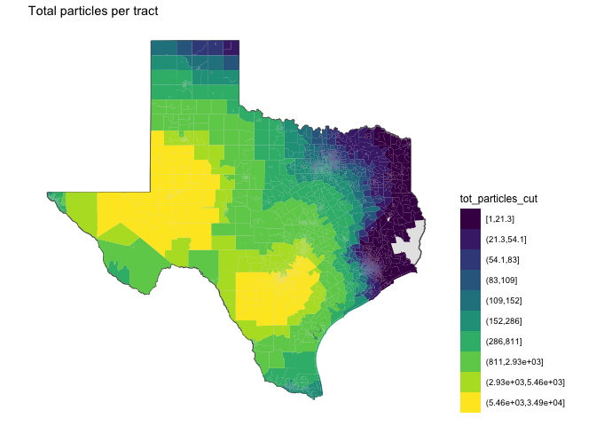
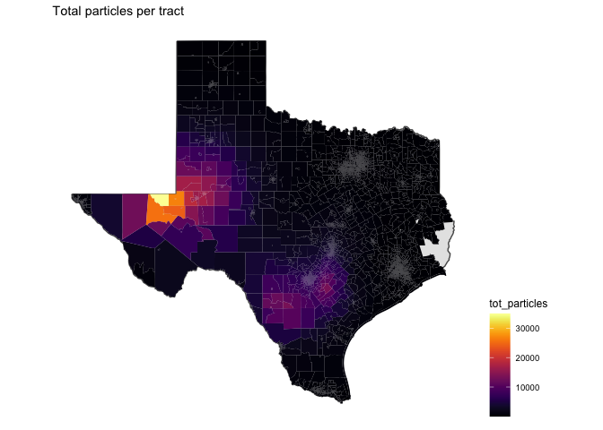
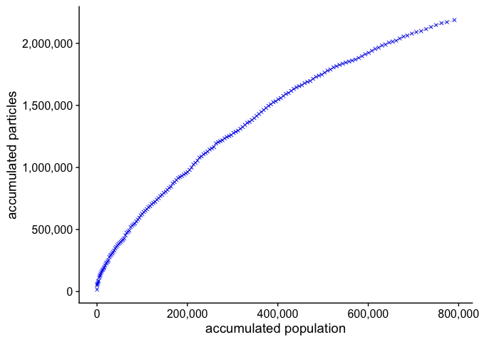

# particles


<!-- ```{python} -->
<!-- import wget -->
<!-- from zipfile import ZipFile -->
<!-- import os -->

<!-- url = 'https://www2.census.gov/geo/tiger/TIGER2016/TRACT/tl_2016_48_tract.zip' -->
<!-- wget.download(url, os.path.expanduser('~/tmp')) -->
<!-- file_name = os.path.expanduser('~/tmp/tl_2016_48_tract.zip') -->
<!-- ZipFile(file_name, 'r').extractall(os.path.expanduser('~/tmp/tl_2016_48_tract/')) -->
<!-- os.system("ls ~/tmp/tl_2016_48_tract/") -->
<!-- ``` -->


A total of 7,912,073 particles were simulated.

A total of 5152 tracts were exposed.

## Total particles per month time series

<!-- -->

## Total particles per tract

Color scheme in deciles.

<!-- -->

Continuous gradient

<!-- -->

<!-- ## Monthly mean flares per tract -->

<!-- ```{r} -->
<!-- tracts_sf %>%  -->
<!--   left_join(flares %>%  -->
<!--               group_by(GEOID, yyyy_mm) %>%  -->
<!--               summarise(flares = sum(flares, na.rm = T)) %>%  -->
<!--               group_by(GEOID) %>%  -->
<!--               summarise(mu_flares = mean(flares, na.rm = T))) %>%  -->
<!--   filter(!is.na(mu_flares)) %>%  -->
<!-- ggplot() +  -->
<!--   geom_sf(data = filter(states_sf, ID == "texas")) +  -->
<!--   geom_sf(aes(fill = mu_flares), colour = NA, lwd = 0) + -->
<!--   theme_map() -->
<!-- ``` -->


## Cap exposure to particles

A total of 27,455,983 people live in tracts where simulated particles dispersed.

In general, tracts with higher number of particles are less populated. 

<!-- -->


Exposed population is considered to be people living in tracks that accumulated more than 7500 particles in a year. A total of 790,820 people were exposed.

<!-- -->


<!-- ```{r, include=FALSE} -->
<!-- flares_cbsa <- flares %>% -->
<!--   group_by(yyyy_mm, cbsa) %>% -->
<!--   summarise(flares = sum(flares)) -->
<!-- myPalette <- colorRampPalette(rev(brewer.pal(11, "Spectral"))) -->
<!-- sc <- scale_color_gradientn(colours = myPalette(100), -->
<!--                              limits=c(min(flares_cbsa$flares), -->
<!--                                       max(flares_cbsa$flares))) -->

<!-- cbsa_flares_ts <- list() -->
<!-- cbsa_sf %<>% -->
<!--   arrange(desc(flares_per_cap)) -->
<!-- #i = 1 -->
<!-- for(i in 1:nrow(cbsa_sf)) { -->
<!--   cbsa_ <- cbsa_sf$cbsa[i] -->
<!--   cbsa_name_ <- cbsa_sf$cbsa_name[i] -->
<!--   flares_per_cap_ <- cbsa_sf$flares_per_cap[i] -->

<!--   map <- cbsa_sf %>% -->
<!--     filter(cbsa == cbsa_) %>% -->
<!--     ggplot() + -->
<!--     geom_sf(data = filter(states_sf, ID == "texas")) + -->
<!--     geom_sf(aes(fill = cbsa_)) + -->
<!--     theme_map() + -->
<!--     theme(legend.position = "none") + -->
<!--     labs(title = "flares per cap:", -->
<!--          subtitle = round(flares_per_cap_, digits = 2)) -->

<!--   ts <- flares_cbsa %>% -->
<!--     filter(cbsa == cbsa_) %>% -->
<!--     ggplot() + -->
<!--     geom_point(aes(x = ym(yyyy_mm), y = flares, color = flares)) + -->
<!--     geom_line(aes(x = ym(yyyy_mm), y = flares, color = flares)) + -->
<!--     sc + -->
<!--     theme_cowplot() + -->
<!--     xlim(c(min(ym(flares_cbsa$yyyy_mm)), max(ym(flares_cbsa$yyyy_mm)))) + -->
<!--     theme(legend.position = "none") + -->
<!--     labs(title = cbsa_name_, x = "") -->

<!--   cbsa_flares_ts[[i]] <- plot_grid(map, ts, ncol = 2, rel_widths = c(0.2, 0.8)) -->
<!-- } -->
<!-- cbsa_flares_ts <- marrangeGrob(cbsa_flares_ts, -->
<!--                            nrow = 3, ncol = 1, -->
<!--                            left = "", top = "CBSA's sorted by flares per capita") -->
<!-- ggsave("./flares_output/cbsa_flares_ts.pdf", -->
<!--        cbsa_flares_ts, width = 15, height = 25, units = "cm") -->
<!-- ``` -->
