```r
library(tidyverse)
```

```
## ── Attaching packages ─────────────────────────────────────── tidyverse 1.3.1 ──
```

```
## ✓ ggplot2 3.3.5     ✓ purrr   0.3.4
## ✓ tibble  3.1.5     ✓ dplyr   1.0.7
## ✓ tidyr   1.1.4     ✓ stringr 1.4.0
## ✓ readr   2.0.2     ✓ forcats 0.5.1
```

```
## ── Conflicts ────────────────────────────────────────── tidyverse_conflicts() ──
## x dplyr::filter() masks stats::filter()
## x dplyr::lag()    masks stats::lag()
```

```r
library(magrittr)
```

```
## 
## Attaching package: 'magrittr'
```

```
## The following object is masked from 'package:purrr':
## 
##     set_names
```

```
## The following object is masked from 'package:tidyr':
## 
##     extract
```

```r
library(sf)
```

```
## Linking to GEOS 3.8.1, GDAL 3.1.4, PROJ 6.3.1
```

```r
library(USAboundariesData)

particles <- read_rds("../data/input/particles.rds")
particles <- st_as_sf(particles)
```

```
## Loading required package: sp
```

```r
class(particles)
```

```
## [1] "sf"         "data.frame"
```


```r
head(particles)
```

```
## Simple feature collection with 6 features and 5 fields
## geometry type:  POINT
## dimension:      XY
## bbox:           xmin: -216166 ymin: -1288449 xmax: -215522.2 ymax: -1288268
## CRS:            +proj=aea +lat_1=20 +lat_2=60 +lat_0=40 +lon_0=-96 +x_0=0 +y_0=0 +ellps=GRS80 +datum=NAD83 +units=m +towgs84=0,0,0
##        lon     lat height      Pdate hour                   geometry
## 1 -98.2943 28.9392     27 2016-01-08    1 POINT (-215635.6 -1288288)
## 2 -98.2996 28.9377      7 2016-01-08    1 POINT (-216137.8 -1288449)
## 3 -98.2931 28.9394     34 2016-01-08    1 POINT (-215522.2 -1288268)
## 4 -98.2951 28.9387     16 2016-01-08    1 POINT (-215712.1 -1288344)
## 5 -98.2987 28.9382     15 2016-01-08    1 POINT (-216051.8 -1288393)
## 6 -98.2999 28.9377     12 2016-01-08    1   POINT (-216166 -1288448)
```

<!-- ```{python} -->
<!-- import wget -->
<!-- from zipfile import ZipFile -->
<!-- import os -->

<!-- url = 'https://www2.census.gov/geo/tiger/TIGER2016/TRACT/tl_2016_48_tract.zip' -->
<!-- wget.download(url, os.path.expanduser('~/tmp')) -->
<!-- file_name = os.path.expanduser('~/tmp/tl_2016_48_tract.zip') -->
<!-- ZipFile(file_name, 'r').extractall(os.path.expanduser('~/tmp/tl_2016_48_tract/')) -->
<!-- os.system("ls ~/tmp/tl_2016_48_tract/") -->
<!-- ``` -->


```r
counties = USAboundaries::us_counties()
counties %<>% 
  select(-state_name) %>% 
  filter(statefp == "48")
counties <- st_transform(counties, crs_)
counties
```

```
## Simple feature collection with 254 features and 13 fields
## geometry type:  MULTIPOLYGON
## dimension:      XY
## bbox:           xmin: -959718.5 ymin: -1644200 xmax: 226094.1 ymax: -389683
## CRS:            +proj=aea +lat_1=20 +lat_2=60 +lat_0=40 +lon_0=-96 +x_0=0 +y_0=0 +ellps=GRS80 +datum=NAD83 +units=m
## First 10 features:
##    statefp countyfp countyns       affgeoid geoid       name          namelsad
## 1       48      093 01383832 0500000US48093 48093   Comanche   Comanche County
## 2       48      233 01383902 0500000US48233 48233 Hutchinson Hutchinson County
## 3       48      487 01384029 0500000US48487 48487  Wilbarger  Wilbarger County
## 4       48      381 01383976 0500000US48381 48381    Randall    Randall County
## 5       48      195 01383883 0500000US48195 48195   Hansford   Hansford County
## 6       48      173 01383872 0500000US48173 48173  Glasscock  Glasscock County
## 7       48      129 01383850 0500000US48129 48129     Donley     Donley County
## 8       48      223 01383897 0500000US48223 48223    Hopkins    Hopkins County
## 9       48      467 01384019 0500000US48467 48467  Van Zandt  Van Zandt County
## 10      48      169 01383870 0500000US48169 48169      Garza      Garza County
##    stusps lsad      aland   awater state_abbr jurisdiction_type
## 1      TX   06 2428768926 25719485         TX             state
## 2      TX   06 2298408153 19507502         TX             state
## 3      TX   06 2514738098 18202665         TX             state
## 4      TX   06 2363909277 25203161         TX             state
## 5      TX   06 2382296646  1548341         TX             state
## 6      TX   06 2331552974  2245302         TX             state
## 7      TX   06 2400676098 15901856         TX             state
## 8      TX   06 1987636011 65632971         TX             state
## 9      TX   06 2182250335 44149754         TX             state
## 10     TX   06 2313937124  7209242         TX             state
##                          geometry
## 1  MULTIPOLYGON (((-263653.7 -...
## 2  MULTIPOLYGON (((-479256.2 -...
## 3  MULTIPOLYGON (((-304733.3 -...
## 4  MULTIPOLYGON (((-532197.9 -...
## 5  MULTIPOLYGON (((-476205.9 -...
## 6  MULTIPOLYGON (((-520449 -91...
## 7  MULTIPOLYGON (((-439006.7 -...
## 8  MULTIPOLYGON (((12270.07 -7...
## 9  MULTIPOLYGON (((-6853.598 -...
## 10 MULTIPOLYGON (((-491809 -76...
```

## 3 month exposure


```r
tracts_sf$count <- lengths(st_intersects(tracts_sf, particles))

library(viridis)
```

```
## Loading required package: viridisLite
```

```
## 
## Attaching package: 'viridis'
```

```
## The following object is masked from 'package:viridisLite':
## 
##     viridis.map
```

```r
library(cowplot)
ggplot() +
  geom_sf(data = tracts_sf, aes(fill = count), size = 0.001) + 
  scale_fill_viridis(option = "B", alpha = 0.8) + 
  theme_cowplot()
```

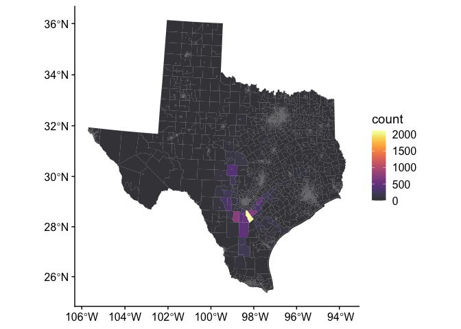<!-- -->

trim zero and above pbl


```r
particles_trim <- particles %>% 
  filter(height > 0, 
         height <= 2665)

tracts_sf$count <- lengths(st_intersects(tracts_sf, particles_trim))

ggplot() +
  geom_sf(data = tracts_sf, aes(fill = count), size = 0.001) + 
  scale_fill_viridis(option = "B", alpha = 0.8) + 
  theme_cowplot()
```

<!-- -->


```r
counties$count <- lengths(st_intersects(counties, particles_trim))

ggplot() +
  geom_sf(data = counties, aes(fill = count), size = 0.001) + 
  scale_fill_viridis(option = "B", alpha = 0.8) + 
  theme_cowplot()
```

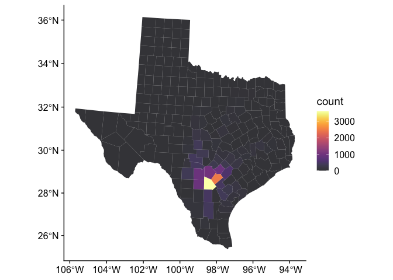<!-- -->

## weekly density


```r
library(lubridate)
```

```
## 
## Attaching package: 'lubridate'
```

```
## The following object is masked from 'package:cowplot':
## 
##     stamp
```

```
## The following objects are masked from 'package:base':
## 
##     date, intersect, setdiff, union
```

```r
particles %<>% 
  mutate(week = lubridate::week(Pdate))

particles_trim %<>% 
  mutate(week = lubridate::week(Pdate))

table(particles$week)
```

```
## 
##    2    3    5    6    7   10 
## 4738 3561 1152 4763 3551 1200
```

```r
table(particles_trim$week)
```

```
## 
##    2    3    5    6    7   10 
## 4737 3561 1152 4763 3551 1200
```


```r
p <- list()
for(x in unique(particles$week)) {
  xx <- particles_trim %>% 
    filter(week == x)
  tracts_sf$density <- lengths(st_intersects(tracts_sf, xx)) / 
  as.numeric(st_area(tracts_sf)) * 1e6

p[[x]] <- ggplot() +
  geom_sf(data = tracts_sf, aes(fill = density), size = 0.001) + 
  scale_fill_viridis(option = "B", alpha = 0.8) + 
  theme_cowplot()
}
p
```

```
## [[1]]
## NULL
## 
## [[2]]
```

<!-- -->

```
## 
## [[3]]
```

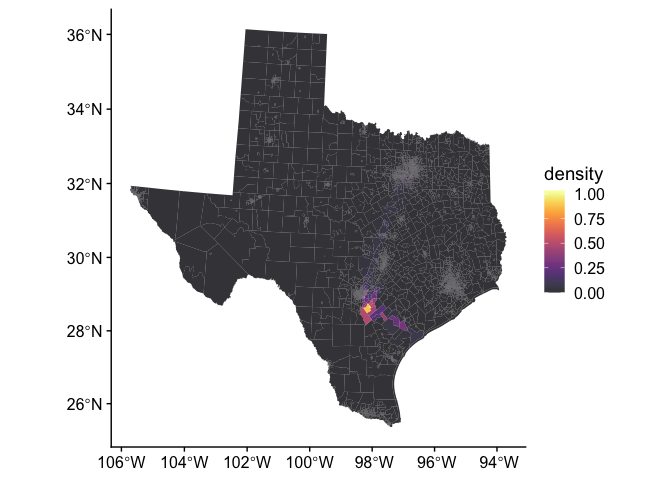<!-- -->

```
## 
## [[4]]
## NULL
## 
## [[5]]
```

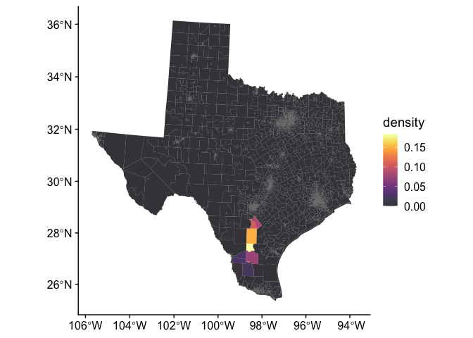<!-- -->

```
## 
## [[6]]
```

<!-- -->

```
## 
## [[7]]
```

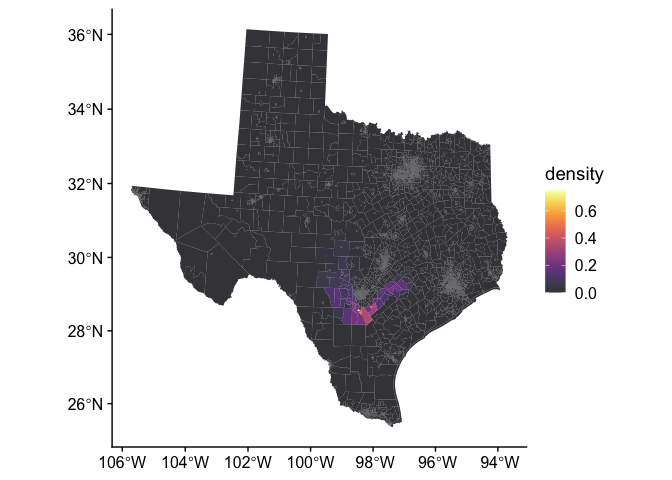<!-- -->

```
## 
## [[8]]
## NULL
## 
## [[9]]
## NULL
## 
## [[10]]
```

<!-- -->

## how far do they go


```r
p <- list()
for(x in unique(particles$hour)) {
  xx <- particles_trim %>% 
    filter(hour == x)
  tracts_sf$density <- lengths(st_intersects(tracts_sf, xx)) / 
  as.numeric(st_area(tracts_sf)) * 1e6

p[[x]] <- ggplot() +
  geom_sf(data = tracts_sf, aes(fill = density), size = 0.001) + 
  scale_fill_viridis(option = "B", alpha = 0.8) + 
  theme_cowplot()
}
p
```

```
## [[1]]
```

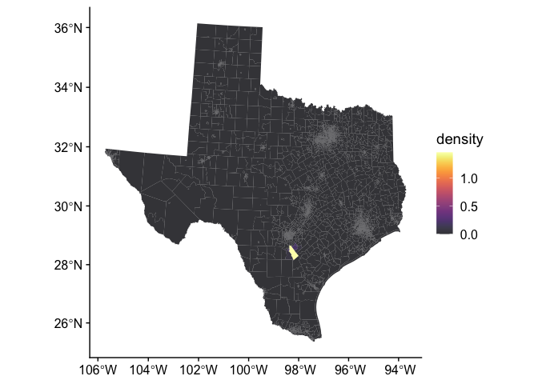<!-- -->

```
## 
## [[2]]
```

<!-- -->

```
## 
## [[3]]
```

<!-- -->

```
## 
## [[4]]
```

<!-- -->

```
## 
## [[5]]
```

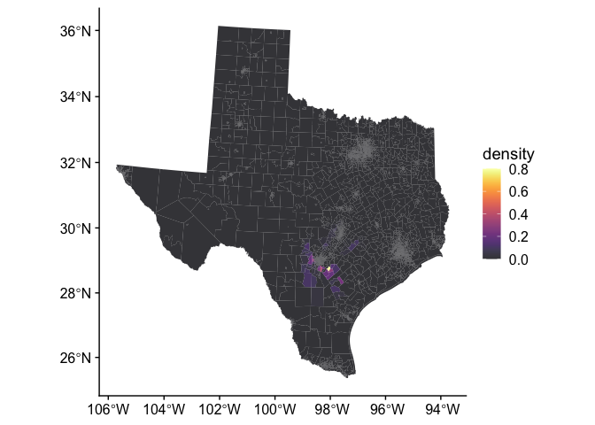<!-- -->

```
## 
## [[6]]
```

<!-- -->

```
## 
## [[7]]
```

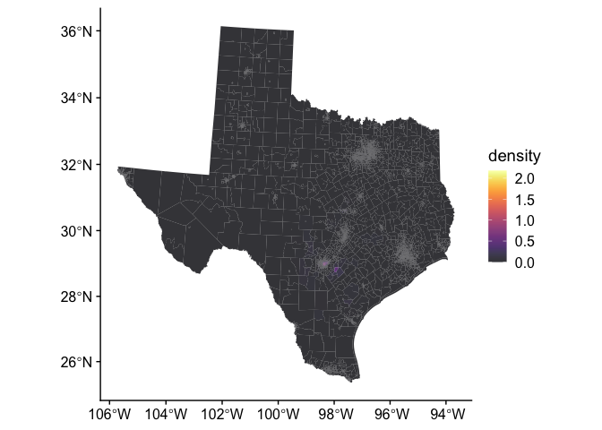<!-- -->

```
## 
## [[8]]
```

<!-- -->

```
## 
## [[9]]
```

<!-- -->

```
## 
## [[10]]
```

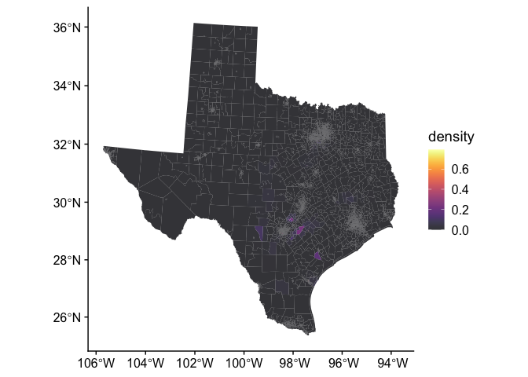<!-- -->

```
## 
## [[11]]
```

<!-- -->

```
## 
## [[12]]
```

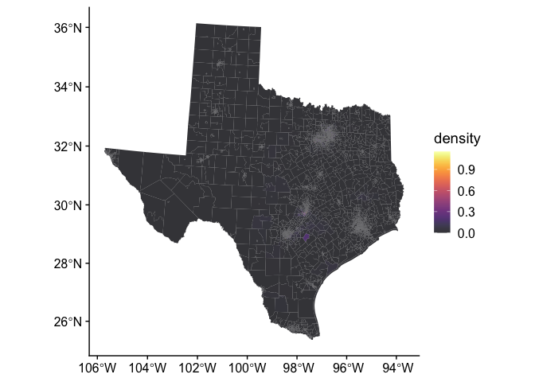<!-- -->

## Distance after 12 hours


```r
lat <- mean(particles$lat[particles$hour == 1])
lon <- mean(particles$lon[particles$hour == 1])
origin <- data.frame(lat = lat, lon = lon)
origin <- st_as_sf(origin,
                   coords = c("lat","lon"), 
                   crs = st_crs(particles))

dist_travelled <- st_distance(x = particles[particles$hour == 12,], 
            y = origin, 
            by_element = TRUE)
dist_travelled <- dist_travelled / 1000
summary(dist_travelled)
```

```
##    Min. 1st Qu.  Median    Mean 3rd Qu.    Max. 
##   764.6  1090.4  1211.5  1198.5  1294.2  1540.8
```


```r
hist(dist_travelled)
```

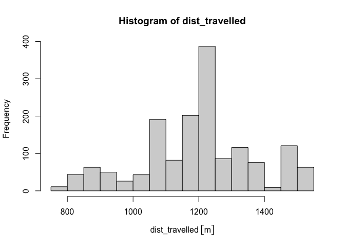<!-- -->

