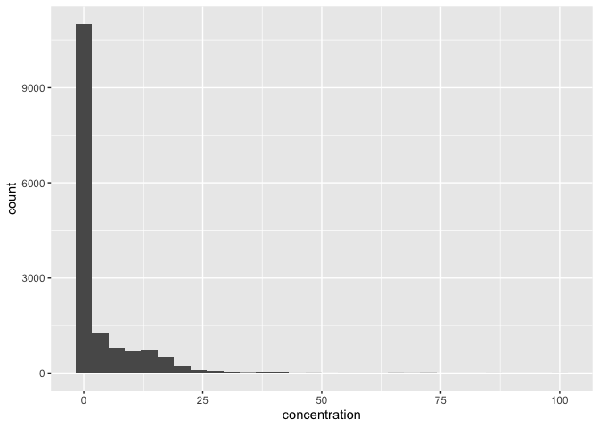
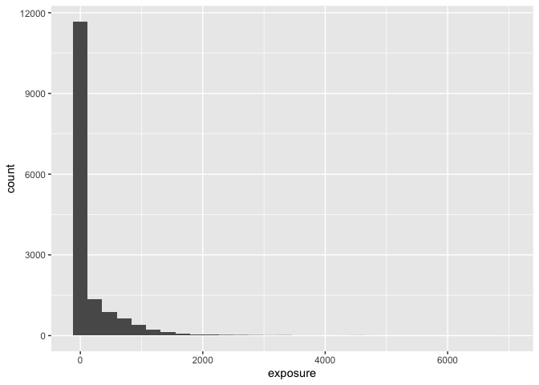
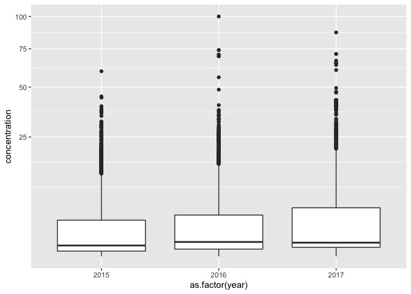
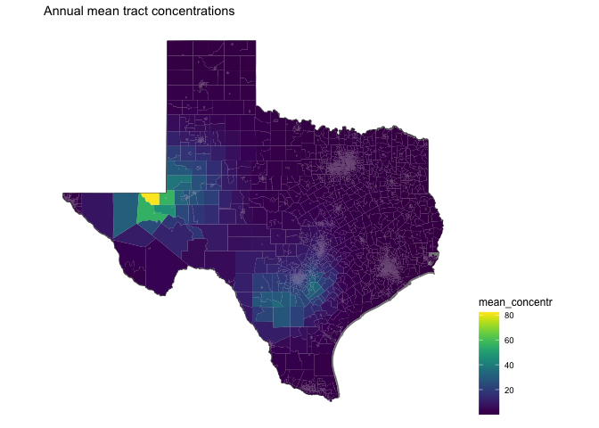
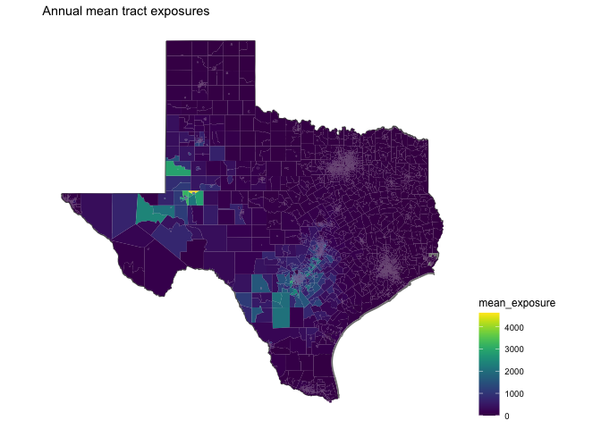

# particles


<!-- ```{python} -->
<!-- import wget -->
<!-- from zipfile import ZipFile -->
<!-- import os -->

<!-- url = 'https://www2.census.gov/geo/tiger/TIGER2016/TRACT/tl_2016_48_tract.zip' -->
<!-- wget.download(url, os.path.expanduser('~/tmp')) -->
<!-- file_name = os.path.expanduser('~/tmp/tl_2016_48_tract.zip') -->
<!-- ZipFile(file_name, 'r').extractall(os.path.expanduser('~/tmp/tl_2016_48_tract/')) -->
<!-- os.system("ls ~/tmp/tl_2016_48_tract/") -->
<!-- ``` -->


## Wind concentration and exposure


```
## Joining, by = "GEOID"
```

The units of the output of the original disperseR link_units function is "air parcel counts per 12 sq km". Zero month counts are not included, as is mean and median cannot be calculated.


```
## `summarise()` has grouped output by 'year', 'GEOID'. You can override using the `.groups` argument.
```

```
##     Min.  1st Qu.   Median     Mean  3rd Qu.     Max. 
##     1.00    41.23   136.50  1382.79  1290.51 40073.29
```

```
##     Min.  1st Qu.   Median     Mean  3rd Qu.     Max. 
##   0.0025   0.1029   0.3406   3.4506   3.2204 100.0000
```

```
##     Min.  1st Qu.   Median     Mean  3rd Qu.     Max. 
##    0.000    5.001   17.132  176.031  117.863 6919.584
```


```
## `stat_bin()` using `bins = 30`. Pick better value with `binwidth`.
```

<!-- -->


```
## `stat_bin()` using `bins = 30`. Pick better value with `binwidth`.
```

<!-- -->


```
## $`2015`
##     Min.  1st Qu.   Median     Mean  3rd Qu.     Max. 
##  0.00250  0.06987  0.24705  3.27144  2.39811 59.69168 
## 
## $`2016`
##     Min.  1st Qu.   Median     Mean  3rd Qu.     Max. 
##   0.0025   0.1218   0.4155   3.2458   3.0993 100.0000 
## 
## $`2017`
##    Min. 1st Qu.  Median    Mean 3rd Qu.    Max. 
##  0.0025  0.1797  0.3781  3.8395  4.2485 87.1968
```

<!-- -->


```
## Joining, by = "GEOID"
```

<!-- -->

<!-- -->
